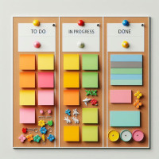

Arrêtons avec Agile SAFe Scrum !
################################

:date: 2024-07-12
:tags: agile,safe,scrum,framework,management,sprint,daily,retrospective,planning
:category: Agile
:slug: stop-agile-safe-scrum
:authors: Morgan
:summary: Arrêtons avec Agile SAFe Scrum !

À mon tour d'ajouter ma pierre à l'édifice des articles à charge sur `Agile <https://www.atlassian.com/fr/agile/agile-at-scale/what-is-safe>`_ !
Je tiens à préciser que c'est mon ressenti personnel au bout de plusieurs années de travail avec cette méthode dans le monde de
l'entreprise et non une vérité absolue.

Make programming fun again
==========================

La programmation, à la base, c'est **fun**. Et c'est bien pour ça qu'on a été attiré par ce métier.
On pourrait penser qu'il s'agit d'un métier de production. *Pisser du code*, comme on dit.
Mais en réalité, pour les passionnés, il s'agit d'un métier artistique.
Oui, le code est une **forme d'art**, au même titre que la peinture, l'écriture ou la musique.
Il nécessite de la créativité et le développeur y met toute son âme et sa personnalité.

Le processus est très similaire à celui d'**un musicien qui compose un morceau de musique**.
Le développeur a besoin de toute sa **liberté** pour exprimer son art. À lui de faire **ses choix** de langages et de frameworks,
d'organiser son code comme il l'entend. Il a le droit de se tromper, de recommencer pour faire mieux et de ne pas atteindre
la perfection.

La méthode Agile SAFe Scrum et ses processus **réduisent à néant cette créativité** et se concentrent uniquement sur la partie production.

On devient alors le développeur n°3 de l'équipe 2 qui travaille sur la tâche Jira 34762 dans le sprint 34 de l'épique 5678 pour la release 26.
À terme, on se transforme en robot prêt à faire un **burn-out** à tout moment.

Des pratiques sectaires
=======================

Franchement, cette méthode a tous les codes d'une **secte**. On va en parcourir ensemble en vrac :

- les réunions sont carrément appelées **cérémonies** ou **rituels**, dois-je en rajouter ?
- les Scrum Masters et coachs Agile sont l'équivalent des **prêtres** et évêques qui prêchent la bonne parole.
- les rétrospectives sont une sorte de **confessionnal** où on y absout les péchés.
- aller au PI planning, c'est comme faire un **pèlerinage** pour assister à la grande messe. 
- il a sa bible, le `manifeste Agile <https://agilemanifesto.org/>`_, son propre `langage <https://agiliste.fr/lexique-agile-scrum/>`_ et ses adeptes.

Tout y est.

Mais le pire de tout, c'est qu'on y retrouve même la notion de **blasphème**.
Quiconque dans une équipe se mettrait à critiquer ouvertement la méthodologie du projet peut s'en faire exclure.

Vraiment flippant.

Infantilisation
===============

Tous ces rituels ont tendance à infantiliser les développeurs et à réduire leur autonomie.

Abordons rapidement l'horreur des **daily meetings**.
On se croirait à l'école primaire où on doit montrer qu'on a bien travaillé la veille. 

*Non mais t'as pas compris, c'est pour organiser la journée.* 

Ouais ok, mais vous croyez pas que les membres d'une équipe se parlent naturellement au cours de la journée au besoin ?
Vous croyez qu'on attend le daily du lendemain avant de se dire les choses s'il y a un problème ?

Une équipe qui fonctionne **se parle au quotidien** et n'a pas besoin de ce genre de réunions.
Laissez les développeurs se débrouiller entre eux !

Et je n'aborde même pas les jeux agiles à base de construction de tours Kapla et autres. Ça serait trop facile.

Les specs
=========

*Les specs changent tout le temps et il faut s'y adapter. C'est ça être Agile !*

Alors ok, les specs peuvent changer. Mais franchement, si on avait pris le temps de rédiger un vrai **cahier des charges** comme dans le temps, avec validation du client,
tu ne penses pas que ça aurait limité la casse et amélioré la compréhension et les besoins du projet ?

Avec ce système d'itérations et de sprints, on **perd toute vue d'ensemble** et de vision globale sur le long terme.

*Rendez-moi mon cahier des charges !*

La réunionite
=============

Des réunions, des réunions, des réunions.

Bon, je ne voulais pas spécialement m'éterniser sur ce sujet mais je suis obligé d'en parler à minima.
Il y a énormément de temps perdu de ce côté-là. Faire des réunions avec les clients pour définir les besoins, ok.
Mais pour le reste ? Poubelle.

Une fois que tu auras atteint le stade de **faire une réunion pour préparer une autre réunion**, le combat est perdu.
On atteint parfois limite le stade de `Inception <https://www.allocine.fr/film/fichefilm_gen_cfilm=143692.html>`_
avec le concept de réunion dans la réunion dans la réunion.

Que dire de plus ?

Ton âme est aspirée petit à petit dans le néant et est vidée de toute énergie vitale.

Courage.

Ah ! Et arrêtez de vous plaindre que les développements prennent du retard si on est **en réunion la moitié du temps** !

Le chiffrage
============

Alors là, on est dans le domaine de la grosse blague.

Le chiffrage en complexité, ça ne marche pas.
C'est toujours faux et complètement bancal.
Et intérieurement, tout est quand même converti en jour-homme.

Quelle perte de temps.

La **priorisation des tâches** dans le Kanban est la seule nécessité.

Et `Jira <https://www.atlassian.com/fr/software/jira>`_ ... mon dieu je crois qu'au bout d'un moment tout le monde déteste cette appli, c'est inévitable.

Les juniors
===========

Alors ce point, je le trouve assez terrible, car ça représente le futur de notre métier.
Et ça m'attriste vraiment pour la nouvelle génération de développeurs qui arrivent.

Tous les juniors qui sortent de l'école ne connaissent plus que la méthode Agile, désormais enseignée en classe.
Ils n'envisagent même pas qu'il a existé un monde sans, et limite certains n'arrivent même plus à penser en dehors de ce cadre.

Bientôt, tout sera gangrené par cette méthode et on ne pourra plus en sortir.
Petit à petit, tout ne sera plus que Agile Scrum.

Les 3/4 des offres d'emploi disponibles sur le marché mentionnent systématiquement Agile Scrum.
Trouver un poste qui ne la mentionne pas devient un véritable parcours du combattant.

Du bon ?
========

Bien évidemment, **tout Agile n'est pas à jeter**. C'est pourquoi je m'attaque spécifiquement à SAFe Scrum.

À l'origine, le manifeste partait d'une bonne intention, qui était de redonner le pouvoir aux développeurs face à la hiérarchie.
Mais malheureusement, dans les faits, le monde de l'entreprise se l'est approprié, a gardé les éléments qui l'arrangeaient et ça
s'est retourné contre nous.

Je t'invite à regarder ce qui se dit dans le manifeste du `Software Craftsmanship <https://manifesto.softwarecraftsmanship.org/>`_ qui
redéfinit certains concepts Agile de manière plus saine :

- Pas seulement des logiciels opérationnels, mais aussi des logiciels bien conçus.
- Pas seulement l'adaptation aux changements, mais aussi l'ajout constant de la valeur.
- Pas seulement les individus et leurs interactions, mais aussi une communauté de professionnels.
- Pas seulement la collaboration avec les clients, mais aussi des partenariats productifs.

*Et XP dans tout ça ?*

On va quand même garder certains concepts de `Extreme Programming <https://en.wikipedia.org/wiki/Extreme_programming>`_,
comme le focus sur les **tests unitaires**, l'**intégration continue**, la qualité du code
via la revue de **merge requests** et éventuellement le **Test Driven Development**.

Enfin, personnellement, le **pair programming**, c'est pas trop mon délire, mais je n'ai rien contre.

*Mais Scrum et SAFe donc ?*

Non, ça dégage.

Que faire ?
===========

Si vous êtes dans une boîte complètement sectaire, il n'y a malheureusement rien à faire à part partir. La perte du fun, l'enchaînement des sprints et la réunionite aiguë vont te mener au burn-out.

*Ok mais tu préconises quoi alors ?*

- Lire et se faire sa propre interprétation du manifeste Agile.
- Oublier intégralement Scrum et SAFe.
- S'approprier les concepts de XP et Software Craftsmanship.
- Rédiger un cahier des charges avec le client.
- Discuter en direct avec le client.
- Parler au quotidien avec ton équipe au besoin.
- Garder ta créativité, ton énergie, ta passion et ne deviens pas juste un numéro.
- Choisir les outils et langages selon les besoins. Un bon artisan a sa propre caisse à outils.
- Éviter la réunionite au maximum. Quelques réunions de conception en petit comité suffisent largement.
- Rejoindre une secte, ça finit toujours mal. Dans les cas extrêmes, pars.

Gardons espoir que les mauvaises pratiques de Agile partiront avec le temps et que le monde de l'entreprise passera à autre chose !