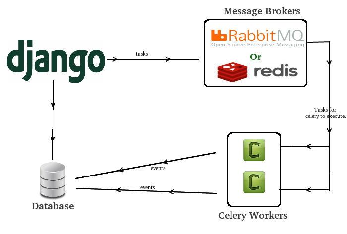

Découverte du gestionnaire de files de tâches Celery
####################################################

:date: 2017-09-28
:tags: rabbitmq,message broker,python,celery,tâches,jobs
:category: Django
:slug: celery
:authors: Morgan
:summary: Découverte du gestionnaire de files de tâches Celery

.. image:: ./images/celery.png
    :alt: Celery
    :align: right

**C'est quoi ? Ça se mange ?**

`Celery <http://www.celeryproject.org/>`_ est un gestionnaire de tâches *asynchrone*.
Il s'occupe de créer des files d'attentes pour les tâches, de les distribuer sur un ou des *workers* et 
d'en répartir la charge. Intégré dans une application web, il va permettre d'ordonner l'exécution de tâches
en background.

Cet outil va t'être utile dans de nombreux cas d'usages. Personnellement, je l'utilise pour une application de streaming
de vidéos et il me permet de lancer les jobs d'encodage des médias sur différents serveurs.

Mais tu vas pouvoir lui laisser le soin de zipper/dézipper de gros fichiers, générer de nombreux documents pdf, lancer
le téléchargement de fichiers en masse ou encore lancer des calculs sur plusieurs machines.

**Mais pourquoi utiliser Celery et pas un autre outil ?**

Déjà, il est mature et très utilisé dans la communauté Python. Son côté *asynchrone* lui donne de bonnes performances.
De plus, il en existe une intégration dans Django. Il y a des clients implémentés dans d'autres languages, comme php ou node.
Grâce à lui, tu vas pouvoir automatiser tout un tas de trucs en répartissant les *workers* et les clients sur différentes machines.

**Broker, quésaco ?**

La première notion à connaître est le **broker**. Il s'agit tout simplement de la file d'attente.
Tu vas pouvoir utiliser plusieurs technos pour gérer le *broker*, comme RabbitMq, Redis, Mongodb, Sqlalchemy, ou même l'orm de Django.

C'est le *broker* qui va permettre la communication entre le(s) workers(s) et le(s) client(s). La techno recommandée par Celery est `RabbitMq <https://www.rabbitmq.com/>`_,
qui utilise le protocole **AMQP**. Je t'en ai `déjà parlé précédemment <http://dotmobo.github.io/rabbitmq.html>`_.

**Backend, quésaco ?**

La seconde notion à connaître est le **backend**. Celui-ci est optionnel et permet de monitorer et de garder une trace des états des tâches.
Les options de stockage sont quasi-similaires à celle du broker (RabbitMq, Redis, etc ...)

**Mon application web qui génère des archives AVANT Celery**

Prenons l'exemple d'une petite application web qui a pour objectif de générer un document au format pdf pour chaque usager présent dans une base de 
données, par année de naissance.

* Étape 1 : choisir une année de naissance
* Étape 2 : cliquer sur "Générer"
* Étape 3 : regarder la roue qui tourne |waiting|
* Étape 4 : se faire un café
* Étape 5 : contempler la roue qui tourne
* Étape 6 : se faire un autre café
* Étape 7 : 504 Gateway Timeout

**Mon application web qui génère des archives AVEC Celery**

* Étape 1 : choisir une année de naissance
* Étape 2 : cliquer sur "Générer"
* Étape 3 : choisir une autre année
* Étape 4 : cliquer sur "Générer"
* Étape 5 : choisir une autre année
* Étape 6 : cliquer sur "Générer"
* Étape 7: Mince, il est où mon café ?

**Objectif**

Pour se faire, l'objectif est d'arriver à une architecture de ce type:

|objectif|

**Installation**

Tu commences par installer RabbitMq:

* Soit sous Ubuntu (tu prends la dernière version ici):

.. code-block:: bash

    echo 'deb http://www.rabbitmq.com/debian/ testing main' | sudo tee /etc/apt/sources.list.d/rabbitmq.list
    wget -O- https://www.rabbitmq.com/rabbitmq-release-signing-key.asc | sudo apt-key add -
    sudo apt-get update && apt-get install rabbitmq-server

* Soit via Docker:

.. code-block:: bash

    docker run -d --hostname myrabbitmq --name myrabbitmq -p 5672:5672 rabbitmq:3

Puis tu installes Celery avec pip:

.. code-block:: bash

    pip install celery==3.1.25

Oui je sais, il y a la version 4.1 de Celery qui est sortie cet été. Mais je n'ai pas encore eu le temps de me pencher dessus, donc il
faudra sûrement mettre à jour ce tuto à l'avenir ! Désolé mon vieux !

**Django - Configuration**

Dans ton fichier de *settings* de django, par exemple *myproject/settings.py*, tu ajoutes les paramètres suivants:

.. code-block:: python

    CELERY_NAME = "myproject"
    CELERY_BACKEND = "amqp"
    CELERY_BROKER = "amqp://guest@localhost//"

**Django - Worker**

Ensuite, tu crées ton worker *myproject/celery.py*:

.. code-block:: python

    import os
    from celery import Celery

    os.environ.setdefault("DJANGO_SETTINGS_MODULE", "myproject.settings")

    from django.conf import settings

    app = Celery(settings.CELERY_NAME, backend=settings.CELERY_BACKEND
        broker=settings.CELERY_BROKER)

    app.config_from_object('django.conf:settings')
    app.autodiscover_tasks(lambda: settings.INSTALLED_APPS)

    @app.task(bind=True)
    def debug_task(self):
        print('Request: {0!r}'.format(self.request))

**Django - Création des tâches**

Puis, tu crées les tâches qui vont te permettre de générer les documents pdf dans *myproject/apps/myapp/tasks.py*:

.. code-block:: python

    from celery import shared_task
    from celery.signals import task_prerun, task_success, task_failure
    from .utils import get_persons_and_generate_pdfs

    @shared_task(bind=True) # utile pour les "reusable apps"
    def task_generate_archive_files(self, date):
        """ generate pdf files """
        get_persons_and_generate_pdfs(date)

    @task_prerun.connect(sender=task_generate_archive_files)
    def start_generate_archive_files(sender=None, *args, **kwargs):
        print("Initialisation du statut du lot en base")

    @task_success.connect(sender=task_generate_archive_files)
    def success_generate_archive_files(sender=None, *args, **kwargs):
        print("Modification du statut du lot en réussi")

    @task_failure.connect(sender=task_generate_archive_files)
    def failure_generate_archive_files(sender=None, *args, **kwargs):
        print("Modification du statut du lot en échec")

**Django - Appel des tâches**

Enfin, tu gères l'appelles des tâches dans *myproject/apps/myapp/views.py*, par exemple:

.. code-block:: python

    from .tasks import task_generate_archive_files

    @login_required()
    def generate_archive_files(request, *args, **kwargs):
        if request.method == "POST":
            date = request.POST.get('birth_date')
            try:
                my_task = task_generate_archive_files.delay(date)
            except IntegrityError:
                messages.add_message(
                    request, messages.ERROR, _("A file for one of those persons already exists"))
            else:
                messages.add_message(
                    request, messages.INFO, _("A file creation task is scheduled"))
            return redirect(reverse("myproject-database:database", "?birth_date={}".format(date)))
        else:
            return HttpResponseForbidden()

À toi d'adapter le code pour que ça colle avec ton projet, tes urls, et autres. C'est qu'un exemple d'utilisation.

**Django - Exécution**

Pour exécuter celery, tu peux alors lancer la commande suivante:

.. code-block:: bash

    celery -A myproject worker -l info

Tu peux même te faire un petit **Makefile** dans ce genre:

.. code-block:: bash

    RABBITMQ := rabbitmq-myproject
    CELERY := myproject

    run-rabbitmq:
        docker ps -aq --filter name=$(RABBITMQ) | xargs -r docker rm -f -v && \
        docker run -d --hostname $(RABBITMQ) --name $(RABBITMQ) -p 5672:5672 rabbitmq:3

    run-celery: run-rabbitmq
        celery -A $(CELERY) worker -l info

    .PHONY: un-rabbitmq run-celery

**Debug**

Tu vas alors avoir un écran de debug qui ressemble à ça:

.. code-block:: bash

    [2016-10-21 16:47:18,568: INFO/MainProcess] Connected to amqp://guest:**@127.0.0.1:5672//
    [2016-10-21 16:47:18,615: INFO/MainProcess] mingle: searching for neighbors
    [2016-10-21 16:47:19,628: INFO/MainProcess] mingle: all alone
    [2016-10-21 16:50:23,354: INFO/MainProcess] Received task: myproject.apps.file.
    tasks.task_generate_archive_files[1755cd30-03f5-4d8a-8d92-fa5b1853a209]
    ...
    ...
    ...
    [2016-10-21 16:50:26,944: INFO/MainProcess] Task myproject.apps.file.
    tasks.task_generate_archive_files[1755cd30-03f5-4d8a-8d92-fa5b1853a209]
    succeeded in 3.588768539018929s: '1755cd30-03f5-4d8a-8d92-fa5b1853a209'

**Tests unitaires**

Pour lancer des tests unitaires sur tes tâches dans ton projet Django, tu peux utiliser le paramètre suivant dans tes *settings*:

.. code-block:: python

    CELERY_ALWAYS_EAGER = True

Ça permet de tester les tâches Celery de manière synchrone et sans *broker* (il utilise un genre de *broker* en mémoire).

**Déploiement avec init.d**

Il existe `un dépôt d'helpers <https://github.com/celery/celery/tree/master/extra>`_ pour déployer avec init.d ou systemd. Par exemple pour init.d :

* Mettre le fichier *celeryd* du dépôt d'*helpers* dans */etc/init.d*.
* Mettre la configuration suivante dans /etc/default/celeryd:

.. code-block:: bash

    export DJANGO_SETTINGS_MODULE="myproject.settings"

    CELERYD_NODES="worker1"
    CELERY_BIN="/home/myuser/.virtualenvs/myproject/bin/celery"
    CELERY_APP="myproject"
    CELERYD_CHDIR="/home/myuser/myproject"
    CELERYD_OPTS="--time-limit=300 --concurrency=8"
    CELERYD_LOG_FILE="/var/log/celery/%N.log"
    CELERYD_PID_FILE="/var/run/celery/%N.pid"
    CELERYD_USER="myuser"
    CELERYD_GROUP="mygroup"
    CELERY_CREATE_DIRS=1

**Monitoring - Exemples**

* Voir le résultat d'une tâche :

.. code-block:: bash

    celery -A myproject result -t tasks.add 4e196aa4-0141-4601-8138-7aa33db0f577

* Voir liste des workers actifs :

.. code-block:: bash

    celery -A myproject status

* Voir les tâches actives :

.. code-block:: bash

    celery -A myproject inspect active

* Voir les statistiques des workers :

.. code-block:: bash

    celery -A myproject inspect stats

* Sinon, il existe le projet `flower <https://github.com/mher/flower>`_ pour monitorer et administrer les workers et les tâches via une appli web.

**En vrac**

Quelques tips en vrac:

* Cron-like :

.. code-block:: bash

    @periodic_task(run_every=crontab(hour='5,13,23', minute=30, day_of_week='monday'))
    def mytask():
    ...

* Sqlite n'aime pas les accès concurrents
* Purger les tâches en attentes :

.. code-block:: bash

    celery -A proj purge

* Récupérer le statut d'une tâche :

.. code-block:: bash

    result = my_task.AsyncResult(task_id)
    result.state

* Attendre le résultat d'une tâche :

.. code-block:: bash

    result = my_task.AsyncResult(task_id)
    result.get()

* Appeler une tâche par son nom depuis une autre machine :

.. code-block:: bash

    from celery import Celery
    celery = Celery()
    celery.config_from_object('celeryconfig')
    celery.send_task('tasks.add', (2,2))

* Appeler une tâches via HTTP :

.. code-block:: bash

    from celery.task.http import URL
    res = URL('http://example.com/multiply').get_async(x=10, y=10)

* On peut appeler une tâche dans une tâche !
* Pour l'optimisation, la sécurité, les extensions, la concurrence, voir la `doc officielle <http://docs.celeryproject.org/en/latest/index.html>`_.