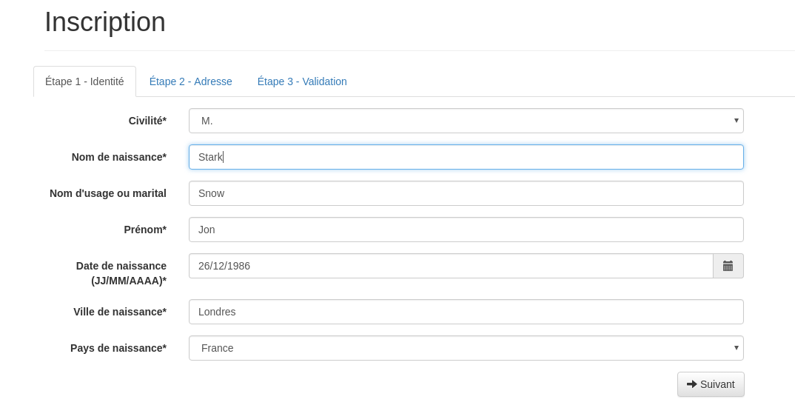

Créer un formulaire sous django avec django-crispy-forms
########################################################

:date: 2016-05-04
:tags: python,django,formulaire,bootstrap,crispy,forms,captcha,datetimepicker
:category: Django
:slug: django-crispy-forms
:authors: Morgan
:summary: Créer un formulaire sous django avec django-crispy-forms

.. image:: ./images/djangopony.png
    :alt: Django
    :align: right

`Django-crispy-forms <http://django-crispy-forms.readthedocs.io/>`_ est une application django
qui va te permettre de construire, customiser et réutiliser tes formulaires en utilisant ton
framework CSS favori. Il permet d'éviter d'écrire une tonne de code dans les templates et applique la
philosophie `DRY <https://fr.wikipedia.org/wiki/Ne_vous_r%C3%A9p%C3%A9tez_pas>`_.

Par défaut, il supporte les frameworks CSS `bootstrap <http://getbootstrap.com/>`_,
`foundation <http://foundation.zurb.com/>`_ et `uni-form <https://github.com/draganbabic/uni-form/>`_.

On va voir comment tu peux créer un formulaire d'enregistrement compatible avec bootstrap en
utilisant des onglets, `un captcha <http://dotmobo.xyz/django-simple-captcha.html>`_,
`une liste de pays <http://dotmobo.xyz/django-countries.html>`_ et
`un date picker <https://github.com/nkunihiko/django-bootstrap3-datetimepicker>`_.

Pour simplifier ce tuto, on ne va pas s'occuper de l'internationalisation. Mais
rien ne t'empêches de la mettre en place de ton côté.

1) L'installation et la configuration
-------------------------------------

C'est parti ! On suppose que tu as déjà installé python 3.5 avec virtualenvwrapper.
Tu crées donc ton environnement virtuel et tu installes les librairies requises:

.. code-block:: bash

    mkvirtualenv -p /usr/bin/python3.5 demo-django-crispy-forms
    pip install Django==1.9.6 django-countries==3.4.1 django-crispy-forms==1.6.0 \
    django-simple-captcha==0.5.1

La version compatible de *django-bootstrap3-datetimepicker* avec django 1.9 n'est pas encore disponible
sur pypi. Du coup, tu l'installes directement depuis github:

.. code-block:: bash

    pip install git+https://github.com/nkunihiko/django-bootstrap3-datetimepicker.git@2fa9ea5

Tu crées un projet django appelé **demo-django-crispy-forms**, qui contient une application **core**:

.. code-block:: bash

    django-admin startproject demo_django_crispy_forms
    cd demo_django_crispy_forms/demo_django_crispy_forms
    mkdir apps && cd apps
    django-admin startapp core

Dans le fichier **settings.py** de ton projet, tu modifies/ajoutes les lignes suivantes:

.. code-block:: python

    LANGUAGE_CODE = 'fr'
    TIME_ZONE = 'Europe/Paris'
    INSTALLED_APPS = (
        ...
        'crispy_forms',
        'django_countries',
        'bootstrap3_datetime',
        'captcha',
        'demo_django_crispy_forms.apps.core'
    )
    CRISPY_TEMPLATE_PACK = 'bootstrap3'

Tu as ainsi défini la langue et le time zone, ajouté les applications installées précédemment
et utilisé le template **bootstrap3** pour *crispy-forms*.

Il te suffit de migrer la base de données et de vérifier que tout est bon pour l'instant.
Depuis le répertoire racine du projet, tu fais:

.. code-block:: bash

    ./manage.py migrate && ./manage.py check

2) Le modèle
------------

Maintenant que tu as fini l'installation et le paramétrage des différentes libraires,
tu vas pouvoir créer le modèle de ton inscription.

Dans **apps/core/models.py**, tu définis le modèle **Registration** suivant :

.. code-block:: python

    from django.db import models
    from django_countries.fields import CountryField

    class Registration(models.Model):
        """
        Modèle de l'inscription
        """
        CIVILITY_CHOICES = (
            ('M.', 'M.'),
            ('MME', 'Mme')
        )
        STREET_TYPE_CHOICES = (
            ('Boulevard', 'Boulevard'),
            ('Avenue', 'Avenue'),
            ('Cours', 'Cours'),
            ('Place', 'Place'),
            ('Rue', 'Rue'),
            ('Route', 'Route'),
            ('Voie', 'Voie'),
            ('Chemin', 'Chemin'),
            ('Square', 'Square'),
            ('Impasse', 'Impasse'),
            ('Rond-point', 'Rond-point'),
            ('Quai', 'Quai')
        )

        civility = models.CharField(max_length=3, choices=CIVILITY_CHOICES,
                                    default='M.', verbose_name="Civilité")
        birth_name = models.CharField(max_length=255, verbose_name="Nom de naissance")
        last_name = models.CharField(max_length=255, blank=True, null=True,
                                     verbose_name="Nom d'usage ou marital")
        first_name = models.CharField(max_length=255, verbose_name="Prénom")
        birth_date = models.DateField(verbose_name="Date de naissance ")
        birth_place = models.CharField(max_length=255, verbose_name="Ville de naissance")
        birth_country = CountryField(max_length=255, verbose_name="Pays de naissance")
        mail = models.EmailField(max_length=255, verbose_name="Mail")
        street_type = models.CharField(max_length=30, verbose_name="Type de rue",
                                       choices=STREET_TYPE_CHOICES, default='Rue')
        street_number = models.CharField(max_length=30, verbose_name="Numéro de rue")
        street = models.CharField(max_length=30, verbose_name="Rue")
        comp_1 = models.CharField(max_length=255, verbose_name="Complément 1",
                                  blank=True, null=True)
        comp_2 = models.CharField(max_length=255, verbose_name="Complément 2",
                                  blank=True, null=True)
        city = models.CharField(max_length=255, verbose_name="Ville")
        zip_code = models.CharField(max_length=255, verbose_name="Code postal")
        country = CountryField(max_length=255, verbose_name="Pays")
        phone = models.CharField(max_length=255, blank=True, null=True,
                                 verbose_name="Téléphone")
        comments = models.TextField(blank=True, null=True, verbose_name="Commentaires")

Pour chaque champ, *crispy-forms* va :

* utiliser le **verbose_name** comme label.
* vérifier les paramètres **blank** et **null** pour savoir si le champ est obligatoire.
* utiliser le type de champ pour définir le type de la balise **<input>**.
* récupérer les valeurs du paramètre **choices** (si présent) pour la balise **<select>**.

Enfin, tu mets à jour la base de données:

.. code-block:: bash

    ./manage.py makemigrations
    ./manage.py migrate

3) Le formulaire
----------------

Place au formulaire. J'ai rajouté des commentaires directement dans le code
ci-dessous pour expliquer les différentes étapes.

Dans **apps/core/forms.py**, tu mets:

.. code-block:: python

    from django import forms
    from .models import Registration
    from crispy_forms.helper import FormHelper
    from crispy_forms.bootstrap import StrictButton
    from bootstrap3_datetime.widgets import DateTimePicker
    from crispy_forms.layout import Layout
    from crispy_forms.bootstrap import TabHolder, Tab
    from captcha.fields import CaptchaField

    class RegistrationForm(forms.ModelForm):
        """
        Formulaire d'inscription
        """

        # Ici, tu vas rajouter les champs supplémentaires au modèle
        # Tu définis le captcha
        captcha = CaptchaField()
        # Tu ajoutes un mail de confirmation
        confirmation_mail = forms.EmailField(label="Mail de confirmation")

        def __init__(self, *args, **kwargs):
            """
            Surcharge de l'initialisation du formulaire
            """
            super().__init__(*args, **kwargs)
            # Tu modifies le label de la date de naissance pour rajouter le format
            self.fields['birth_date'].label = "%s (JJ/MM/AAAA)" % "Date de naissance"
            # Tu utilises FormHelper pour customiser ton formulaire
            self.helper = FormHelper()
            # Tu définis l'id et la classe bootstrap de ton formulaire
            self.helper.form_class = 'form-horizontal'
            self.helper.form_id = 'registration-form'
            # Tu définis la taille des labels et des champs sur la grille
            self.helper.label_class = 'col-md-2'
            self.helper.field_class = 'col-md-8'
            # Tu crées l'affichage de ton formulaire
            self.helper.layout = Layout(
                # Le formulaire va contenir 3 onglets
                TabHolder(
                    # Premier onglet
                    Tab(
                        # Label de l'onglet
                        'Étape 1 - Identité',
                        # Liste des champs du modèle à afficher dans l'onglet
                        'civility',
                        'birth_name',
                        'last_name',
                        'first_name',
                        'birth_date',
                        'birth_place',
                        'birth_country',
                        # Tu rajoutes un bouton "Suivant"
                        StrictButton(
                            ' %s' % "Suivant",
                            type='button',
                            css_class='btn-default col-md-offset-9 btnNext',
                        )

                    ),
                    # Deuxième onglet
                    Tab(
                        # Label de l'onglet
                        'Étape 2 - Adresse',
                        # Liste des champs à afficher
                        'street_number',
                        'street_type',
                        'street',
                        'comp_1',
                        'comp_2',
                        'city',
                        'zip_code',
                        'country',
                        'phone',
                        # Tu rajoutes des boutons "Précédent" et "Suivant"
                        StrictButton(
                            ' %s' % 'Précédent',
                            type='button',
                            css_class='btn-default btnPrevious',
                        ),
                        StrictButton(
                            ' %s' % 'Suivant',
                            type='button',
                            css_class='btn-default col-md-offset-8 btnNext',
                        )
                    ),
                    # Troisième onglet
                    Tab(
                        # Label de l'onglet
                        'Étape 3 - Validation',
                        # Liste des champs à afficher dont les champs supplémentaires
                        'mail',
                        'confirmation_mail',
                        'comments',
                        'captcha',
                        # Tu rajoutes des boutons "Précédent" et "Valider"
                        StrictButton(
                            ' %s' % "Précédent",
                            type='button',
                            css_class='btn-default btnPrevious',
                        ),
                        StrictButton(
                            ' %s' % "Valider",
                            type='submit',
                            css_class='btn-default col-md-offset-8'
                        )
                    ),
                ),
            )

        def clean_confirmation_mail(self):
            """
            Méthode pour vérifier que le mail correspond bien au
            mail de confirmation lors de la validation du formulaire
            """
            confirmation_mail = self.cleaned_data['confirmation_mail']
            mail = self.cleaned_data['mail']
            if mail != confirmation_mail:
                raise forms.ValidationError(
                    "Le mail et le mail de confirmation ne sont pas identiques")
            return confirmation_mail

        class Meta:
            # Tu définis le modèle utilisé
            model = Registration
            exclude = []
            # Tu customises le champ date de naissance pour ajouter le date picker
            widgets = {
                'birth_date': DateTimePicker(
                    options={"format": "DD/MM/YYYY", "pickTime": False,
                             "useStrict": True, "viewMode": "years",
                             "startDate": "01/01/1900"},
                    attrs={'placeholder': 'ex: 05/11/1975'}
                )
            }

4) Les vues
-----------

Maintenant que tu as ton formulaire, il te faut une vue pour afficher le formulaire
et une autre pour afficher un message de confirmation après la validation de celui-ci.

Tu vas créer tout ça dans **apps/core/views.py**:

.. code-block:: python

    from django.views.generic.edit import CreateView
    from .models import Registration
    from django.core.urlresolvers import reverse_lazy
    from django.shortcuts import render
    from .forms import RegistrationForm

    class RegistrationCreate(CreateView):
        """
        Affichage du formulaire
        """
        model = Registration
        form_class = RegistrationForm
        success_url = reverse_lazy('core:success')

    def registration_success(request):
        """
        Message de confirmation
        """
        return render(request, 'core/registration_success.html')

5) Les urls
-----------

Dans le fichier des urls du projet, tu vas inclure les urls de l'application **core**
et l'url pour le captcha.

Dans **urls.py**, tu insères:

.. code-block:: python

    from django.conf.urls import url, include
    from django.contrib import admin
    from .apps.core.urls import urlpatterns as core_urls

    urlpatterns = [
        url(r'^admin/', admin.site.urls),
        url(r'^', include(core_urls, namespace='core')),
        url(r'^captcha/', include('captcha.urls')),
    ]

Et dans **apps/core/urls.py**, tu mets les urls correspondantes à tes deux vues:

.. code-block:: python

    from django.conf.urls import patterns, url
    from .views import RegistrationCreate, registration_success

    urlpatterns = [
        url(r'^$', RegistrationCreate.as_view(), name='add'),
        url(r'^success/$', registration_success, name='success'),
    ]

6) Les templates
----------------

Tu vas créer trois templates:

* Le premier, **base.html**, qui servira de base aux deux autres.
* Le deuxième, **core/registration_form.html**, pour afficher le formulaire.
* Le dernier, **core/registration_success.html**, pour afficher le message de confirmation.

Le template **apps/core/templates/base.html** va contenir:

.. code-block:: html

    <!DOCTYPE html>
    <html lang="fr">
    <head>
        <title>Mon site</title>
        <meta charset="utf-8" />
        <meta name="viewport" content="width=device-width, initial-scale=1.0">
        <meta http-equiv="X-UA-Compatible" content="IE=edge">
        <link rel="stylesheet"
              href="//cdn.jsdelivr.net/bootstrap/3.3.6/css/bootstrap.min.css">
        <link rel="stylesheet"
              href="//cdn.jsdelivr.net/bootstrap/3.3.6/css/bootstrap-theme.min.css">
        
        
    </head>
    <body>
        

        

            

                
            

        

        
        
        

        
        
    </body>
    </html>

C'est une page html5 standard, qui contient les fichiers nécessaires à bootstrap,
un **block page-header** pour afficher le titre de la page et un **block content**
pour afficher le contenu de la page. Les templates suivants vont donc étendre **base.html**.

Pour le template **apps/core/templates/core/registration_form.html**, tu mets:

.. code-block:: html

    
    

    
        {{ form.media }}
    

    
    <h1>Inscription</h1>
    

    
    


    

    
    
    

Pour *crispy-forms*, il ne faut que deux éléments ! Le ****,
qui permet d'utiliser le **** pour afficher le formulaire.

Et c'est tout ! Plutôt cool non ?

Le **{{ form.media }}** est nécessaire au date picker et tout ce qui se trouve dans
le **block foot-javascript** permet de pousser un peu plus la customisation.

Enfin, de la même manière, tu crées le template **apps/core/templates/core/registration_success.html**:

.. code-block:: html

    

    
    <h1>Succès</h1>
    

    
    
Votre inscription a été validée.

    

7) La page d'administration
---------------------------

Pour pouvoir vérifier les futures inscriptions, tu ajoutes le modèle **Registration** dans **apps/core/admin.py**:

.. code-block:: python

    from django.contrib import admin
    from .models import Registration

    class RegistrationAdmin(admin.ModelAdmin):
        list_display = ('birth_name', 'last_name', 'first_name')

    admin.site.register(Registration, RegistrationAdmin)

Tu vas également en profiter pour ajouter un compte admin via:

.. code-block:: bash

    ./manage.py createsuperuser

8) La vérification
------------------

Tout est fini ! Il ne reste plus qu'à vérifier que ça fonctionne correctement.

Tu démarres le serveur:

.. code-block:: bash

    ./manage.py runserver

Puis, tu te rends sur `http://127.0.0.1:8000 <http://127.0.0.1:8000>`_
pour tester ton formulaire !

Après avoir correctement saisie et validé le formulaire, rends-toi sur
`http://127.0.0.1:8000/admin/core/registration/ <http://127.0.0.1:8000/admin/core/registration/>`_
pour vérifier ton inscription.

Tu sais désormais utiliser un outil puissant pour générer tes nombreux formulaires !
Et pour voir le résultat final, tu peux te rendre sur
`mon dépôt github <https://github.com/dotmobo/demo-django-crispy-forms>`_.
