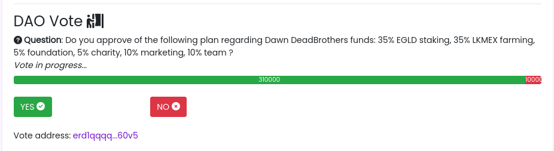

Smart Contract Elrond en Rust : DAO vote
#########################################

:date: 2022-07-06
:tags: elrond,rust, dao, vote
:category: Elrond
:slug: elrond-sc-rust-dao-vote
:authors: Morgan
:summary: Smart Contract Elrond en Rust : DAO vote

.. image:: ./images/elrond.png
    :alt: Elrond
    :align: right

Allez, c'est parti pour une série d'articles concernant l'écriture de Smart Contract `Elrond <https://elrond.com/>`_
en `Rust <https://rust-lang.org/>`_.
Etant dans l'équipe d'un projet NFT sur Elrond, j'ai pu explorer certains facettes de cette blockchain.

Contexte
--------

On va commencer par écrire un SC en Rust pour implémenter le système de vote d'une `DAO <https://fr.wikipedia.org/wiki/Organisation_autonome_d%C3%A9centralis%C3%A9e>`_.
Imaginons que la DAO de notre projet NFT a son propre token (ici $DEAD). Et que nous souhaitons mettre en place
un système de vote où les membres peuvent utiliser des $DEAD pour voter.

Ici, le nombre de $DEAD accumulés équivaut à une puissance de vote. Les membres qui ont plus de tokens
ont donc plus de pouvoir dans la DAO.

On aura donc une question stockée dans le SC et la possibilité de voter oui ou non avec des $DEAD.
A la fin du vote, les membres doivent pouvoir récupérer leurs tokens.

Tools
-----

Tu vas avoir besoin de Python 3, de Rust et de Erdpy.

.. code-block:: bash

    sudo apt install libncurses5 python3
    wget -O erdpy-up.py https://raw.githubusercontent.com/ElrondNetwork/elrond-sdk-erdpy/master/erdpy-up.py
    python3.8 erdpy-up.py
    curl --proto '=https' --tlsv1.2 -sSf https://sh.rustup.rs | sh

Prends ton éditeur préféré et c'est parti !

Smart Contract
--------------

On va utiliser un template vide à l'aide de **erdpy** pour créer un SC. Tu peux trouver des informations complémentaire
dans la `documentation officielle <https://docs.elrond.com/sdk-and-tools/erdpy/erdpy/>`_, notamment pour te créer le fichier
**pem** de ton **wallet** nécessaire au déploiement en production.

.. code-block:: bash

    erdpy contract new vote --template empty

Pour faire ça proprement, on va créer un fichier **vote_info.rs** dans **src** qui va contenir
la structure de notre vote. On va y stocker l'adresse Elrond du votant ainsi qui le nombre de $DEAD
qu'il a utilisé pour voter.

.. code-block:: rust

    elrond_wasm::imports!();
    elrond_wasm::derive_imports!();

    #[derive(TypeAbi, TopEncode, TopDecode, PartialEq, Debug)]
    pub struct VoteInfo<M: ManagedTypeApi> {
        pub address: ManagedAddress<M>,
        pub amount: BigUint<M>,
    }

Le fichier qui va principalement nous intéresser est **src/empty.rs**.

A chaque déploiement ou mise à jour du smart contract, la fonction **init** est appelée.
Il faut donc faire attention à ne pas écraser des valeurs !

On va prendre en paramètre la question et l'identifiant du token que l'on souhaite utiliser pour voter.
Et on initialise à 0 le nombre total de vote "oui" et de vote "non", et on démarre le vote.

.. code-block:: rust

    #![no_std]

    elrond_wasm::imports!();

    mod vote_info;
    use vote_info::VoteInfo;
    use elrond_wasm::types::heap::BoxedBytes;

    #[elrond_wasm::contract]
    pub trait Vote {
        // La fonction d'initialisation au déployement du contrat
        // On définit la question et les réponses possibles
        #[init]
        fn init(&self, question: BoxedBytes, token_id: TokenIdentifier) {
            self.question().set(&question);
            self.token_id().set(&token_id);
            if self.yes().is_empty() {
                self.yes().set(BigUint::from(0u32));
            }
            if self.no().is_empty() {
                self.no().set(BigUint::from(0u32));
            }
            if self.in_progress().is_empty() {
                self.in_progress().set(1u32);
            }
        }
    }

En bas de notre **trait**, on va définir l'ensemble des valeurs que l'on souhaite stocker dans le SC.
C'est directement stocké dans la blockchain via **storage_mapper** et on peut visualiser les données depuis
une dapp par exemple en appelant les méthodes de **view**.

.. code-block:: rust

    // La question
    #[view(getQuestion)]
    #[storage_mapper("question")]
    fn question(&self) -> SingleValueMapper<BoxedBytes>;

    // Le nombre de votes pour la réponse "oui"
    #[view(getYes)]
    #[storage_mapper("yes")]
    fn yes(&self) -> SingleValueMapper<BigUint>;

    // Le nombre de votes pour la réponse "non"
    #[view(getNo)]
    #[storage_mapper("no")]
    fn no(&self) -> SingleValueMapper<BigUint>;

    // Le token utilisé pour les votes
    #[view(getTokenId)]
    #[storage_mapper("token_id")]
    fn token_id(&self) -> SingleValueMapper<TokenIdentifier>;

    // Si le vote est terminé
    #[view(getInProgress)]
    #[storage_mapper("in_progress")]
    fn in_progress(&self) -> SingleValueMapper<u32>;

    // L'information du votant
    #[view(getVoteInfo)]
    #[storage_mapper("vote_info")]
    fn vote_info(&self, address: &ManagedAddress) -> SingleValueMapper<VoteInfo<Self::Api>>;

Ensuite, on va créer nos deux fonctions **vote_yes** et **vote_no**.
Il y a sûrement moyen de mutualiser ces deux fonctions, mais j'ai fait au plus rapide.

Il faut mettre quelques garde-fous, notamment pour vérifier que le type de token envoyé est le bon et
que le vote est toujours en cours.

Cette fonction doit donc être **payable**. Son fonctionnement est tout simple. On incrémente le nombre total de "oui" ou de "non", et on
ajoute ou met à jour l'information du votant.

Le **Ok(())** à la fin est important, car il permet de confirmer que la transaction s'est bien effectuée.

.. code-block:: rust

    #[payable("*")]
    #[endpoint]
    fn vote_yes(
        &self,
        #[payment_token] payment_token: TokenIdentifier,
        #[payment_amount] payment_amount: BigUint,
    ) -> SCResult<()> {
        require!(
            payment_token == self.token_id().get(),
            "Invalid payment token"
        );

        require!(
            self.in_progress().get() == 1u32,
            "the vote is over"
        );

        let yes = self.yes().get();
        self.yes().set(&yes + &payment_amount);

        // save info about the voter
        let caller: ManagedAddress = self.blockchain().get_caller();

        // if vote info exists, update it
        if !self.vote_info(&caller).is_empty() {
            let new_vote_info = VoteInfo {
                address: self.blockchain().get_caller(),
                amount: self.vote_info(&caller).get().amount + &payment_amount,
            };
            self.vote_info(&caller).clear();
            self.vote_info(&caller).set(&new_vote_info);
        } else {
            // else create a new vote info
            let new_vote_info = VoteInfo {
                address: self.blockchain().get_caller(),
                amount: payment_amount,
            };
            self.vote_info(&caller).set(&new_vote_info);
        }

        Ok(())
    }

    // On peut voter non en envoyant autant de tokens que souhaité
    #[payable("*")]
    #[endpoint]
    fn vote_no(
        &self,
        #[payment_token] payment_token: TokenIdentifier,
        #[payment_amount] payment_amount: BigUint,
    ) -> SCResult<()> {
        require!(
            payment_token == self.token_id().get(),
            "Invalid payment token"
        );

        require!(
            self.in_progress().get() == 1u32,
            "the vote is over"
        );

        let no = self.no().get();
        self.no().set(&no + &payment_amount);

        // save info about the voter
        let caller: ManagedAddress = self.blockchain().get_caller();

        // if vote info exists, update it
        if !self.vote_info(&caller).is_empty() {
            let new_vote_info = VoteInfo {
                address: self.blockchain().get_caller(),
                amount: self.vote_info(&caller).get().amount + &payment_amount,
            };
            self.vote_info(&caller).clear();
            self.vote_info(&caller).set(&new_vote_info);
        } else {
            // else create a new vote info
            let new_vote_info = VoteInfo {
                address: self.blockchain().get_caller(),
                amount: payment_amount,
            };
            self.vote_info(&caller).set(&new_vote_info);
        }

        Ok(())
    }

A la fin du vote, le votant doit pouvoir récupérer ses tokens. On créé donc une fonction qui sera appelée
par le votant via un bouton dans la **dapp**. On effectue donc une transaction pour lui envoyer le montant total
de ses tokens stockés dans le SC via la fonction **self.send().direct()**.

.. code-block:: rust

    #[endpoint]
    fn withdraw_my_amount(&self) -> SCResult<()> {
        require!(
            self.in_progress().get() == 0u32,
            "the vote is not over"
        );

        let caller: ManagedAddress = self.blockchain().get_caller();

        require!(!self.vote_info(&caller).is_empty(), "Nothing to withdraw!");
        let vote_info = self.vote_info(&caller).get();

        let my_amount = vote_info.amount;
        let token_id = self.token_id().get();

        self.send()
            .direct(&caller, &token_id, 0, &my_amount, &[]);

        self.vote_info(&caller).clear();

        Ok(())
    }

On donne également la possibilité à l'administrateur du smart contract de retirer tous les tokens, au cas où.
On additionne ici le total des "oui" et des "non" et on envoie le tout à l'administrateur.

.. code-block:: rust

    #[only_owner]
    #[endpoint]
    fn withdraw(&self) -> SCResult<()> {
        require!(
            self.in_progress().get() == 0u32,
            "the vote is not over"
        );

        let caller = self.blockchain().get_caller();

        let yes = self.yes().get();
        let no = self.no().get();
        let token_id = self.token_id().get();
        let amount = &yes + &no;

        self.send()
            .direct(&caller, &token_id, 0, &amount, b"withdraw successful");

        Ok(())
    }

Enfin, on ajoute quelques petites fonctions pratiques.

Par exemple, pour stopper le vote :

.. code-block:: rust

    #[only_owner]
    #[endpoint]
    fn finish_vote(&self) -> SCResult<()> {
        self.in_progress().set(0u32);

        Ok(())
    }

Ou pour changer la question :

.. code-block:: rust

    #[only_owner]
    #[endpoint]
    fn change_question(&self, question: BoxedBytes) -> SCResult<()> {
        self.question().set(&question);

        Ok(())
    }

Attention à bien utiliser **only_owner**, sinon n'importe qui pourra appeler ces fonctions !

Enfin, pour récupérer le nombre total de tokens utilisés par le votant :

.. code-block:: rust

    #[view(getMyAmount)]
    fn get_my_amount(&self, address: &ManagedAddress) -> BigUint {
        require!(!self.vote_info(&address).is_empty(), "Nothing to withdraw!");
        let vote_info = self.vote_info(&address).get();
        let amount = vote_info.amount;
        return amount;
    }

Et voilà ! Tu peux jeter un oeil au résultat final sur `mon github <https://github.com/dotmobo/dbc-dashboard/blob/master/contract/vote/src/empty.rs>`_.

Pour tester si tout fonctionne, tu utilise **erdpy** pour compiler ton SC :

.. code-block:: bash

    erdpy contract build

Et pour déployer, il te faut créer à la racine du projet un fichier **erdpy.json** avec les informations
nécessaires au déploiement.
Ici, on déploie sur **devnet**.
Tu pourras trouver dans **arguments** les 2 arguments nécessaires au **init** du SC.
**DEADBROS-fa8f0f** est l'id du token $DEAD sur devnet.

.. code-block:: json

    {
        "configurations": {
            "default": {
                "proxy": "https://devnet-api.elrond.com",
                "chainID": "D"
            }
        },
        "contract":{
            "deploy":{
                "verbose": true,
                "bytecode": "output/vote.wasm",
                "recall-nonce": true,
                "pem": "../../wallet/wallet-owner.pem",
                "gas-limit": 59999999,
                "arguments": [
                    "str:Do you approve of the following plan regarding Dawn DeadBrothers funds: 35% EGLD staking, 35% LKMEX farming, 5% foundation, 5% charity, 10% marketing, 10% team ?",
                    "str:DEADBROS-fa8f0f"
                ],
                "send": true,
                "outfile": "deploy-testnet.interaction.json"
            },
            "upgrade":{
                "verbose": true,
                "bytecode": "output/vote.wasm",
                "recall-nonce": true,
                "pem": "../../wallet/wallet-owner.pem",
                "gas-limit": 59999999,
                "arguments": [
                    "str:Do you approve of the following plan regarding Dawn DeadBrothers funds: 35% EGLD staking, 35% LKMEX farming, 5% foundation, 5% charity, 10% marketing, 10% team ?",
                    "str:DEADBROS-fa8f0f"
                ],
                "send": true,
                "outfile": "deploy-testnet.interaction.json"
            }
        }
    }

On imagine ici que tu as le **pem** de ton **wallet** dans **../../wallet/wallet-owner.pem**.
N'oublie pas d'utiliser un **faucet** pour récupérer des EGLD de tests, car le déploiement a un coût !

Tu déploie le tout et tu croises les doigts !

.. code-block:: bash

    erdpy contract deploy

Tu peux désormais utiliser **erdpy** pour effectuer des transactions et tester les différentes fonctions de ton SC.

.. code-block:: bash

    erdpy tx new --help

Ou alors tu peux directement passer à l'écriture de ton `application frontend <https://github.com/ElrondNetwork/dapp-template>`_ !

Avec une `dapp associée <https://github.com/dotmobo/dbc-dashboard/blob/master/dapp/src/pages/Dao/Components/Vote.tsx>`_, ça peut ressembler à ça :

Have fun !
