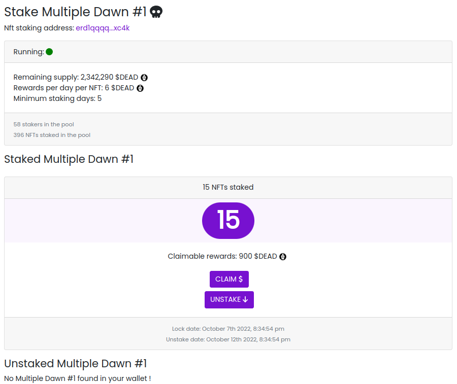

Smart Contract Elrond en Rust : Multiple NFTs staking
#####################################################

:date: 2022-10-16
:tags: elrond,rust, nft, staking
:category: Elrond
:slug: elrond-sc-rust-multiple-nfts-staking
:authors: Morgan
:summary: Smart Contract Elrond en Rust : Multiple NFTs staking

.. image:: ./images/elrond.png
    :alt: Elrond
    :align: right

C'est parti pour un petit article faisant suite au premier dédié `au staking de NFT sur Elrond <https://dotmobo.github.io/elrond-sc-rust-nft-staking.html#elrond-sc-rust-nft-staking>`_.

Contexte
---------

Afin d'avoir un premier jet fonctionnel, on a vu comment staker un NFT sur un smart contract avec quelques limitations :

* Chaque utilisateur représenté par une adresse Elrond ne peut envoyer qu'un seul NFT dans la pool.
* Les récompenses sont à réclamer régulièrement et ne sont pas directement attribuées.
* Une seule collection de NFT est supportée. Donc pour faire une pool de staking sur une autre collection, il
  faudra déployer un deuxième SC.

On va ici voir comment faire sauter la première limitation, c'est-à-dire de permettre le staking de plusieurs NFTs par adresse Elrond dans la pool.

Dans ta **dapp**, tu pourras ainsi faire quelque-chose comme ça :

Smart Contract
--------------

On reprend donc `le code du smart contract précédent <https://github.com/dotmobo/dbc-dashboard/blob/master/contract/nft_staking/src/empty.rs>`_, et on va ajouter une nouvelle fonctionnalité : le staking de plusieurs NFTs.

Tu commences donc par modifier le fichier **src/stake_info.rs** de la manière suivante :

.. code-block:: rust

    elrond_wasm::imports!();
    elrond_wasm::derive_imports!();

    use elrond_wasm::types::heap::Vec;

    #[derive(TypeAbi, TopEncode, TopDecode, PartialEq, Debug)]
    pub struct StakeInfo<M: ManagedTypeApi> {
        pub address: ManagedAddress<M>,
        pub nft_nonce: Vec<u64>,
        pub lock_time: u64,
        pub unstake_time: u64,
    }

L'astuce ici, c'est d'avoir transformé le champ **nft_nonce** en un vecteur de **u64**. Cela permet de stocker plusieurs valeurs dans ce champ.

Tu va maintenant modifier le fichier **src/empty.rs** pour prendre en compte cette modification et permettre la gestion de plusieurs NFTs par adresse.

Au niveau du bloc d'initialisation, on a juste rajouté un nouveau paramètre appelé **nbr_of_nft_staked** qui va nous permettre de stocker le nombre
total de NFTs stakés, pour donner une information globale du contract à l'utilisateur.

.. code-block:: rust

    #![no_std]

    elrond_wasm::imports!();
    use elrond_wasm::types::heap::Vec;

    mod stake_info;
    use stake_info::StakeInfo;

    #[elrond_wasm::contract]
    pub trait NftStaking {
        #[init]
        fn init(
            &self,
            nft_identifier: EgldOrEsdtTokenIdentifier,
            minimum_staking_days: u64,
            rewards_token_id: EgldOrEsdtTokenIdentifier,
            rewards_token_amount_per_day: BigUint,
            rewards_token_total_supply: BigUint,
        ) {
            self.nft_identifier().set(&nft_identifier);
            self.minimum_staking_days().set(&minimum_staking_days);
            self.rewards_token_id().set(&rewards_token_id);
            self.rewards_token_amount_per_day()
                .set(&rewards_token_amount_per_day);
            self.rewards_token_total_supply()
                .set(&rewards_token_total_supply);
            // if staking status is empty, set it to false
            if self.staking_status().is_empty() {
                self.staking_status().set(true);
            }
            // if staking end time is empty, set it to 0
            if self.staking_end_time().is_empty() {
                self.staking_end_time().set(0);
            }
            // if nbr of stakers is empty, set it to 0
            if self.nbr_of_stakers().is_empty() {
                self.nbr_of_stakers().set(0);
            }
            // if nbr of nft staked is empty, set it to 0
            if self.nbr_of_nft_staked().is_empty() {
                self.nbr_of_nft_staked().set(0);
            }
        }

Au niveau des **storage_mapper** et des **view**, tu peux déjà rajouter une **view** pour le nouveau champ
**getNbrOfNftStaked**. Tu va également modifier la méthode **getNftNonce** pour qu'elle renvoie un vecteur de **u64**.
Enfin, tu calcules le montant des récompenses à envoyer à l'utilisateur en fonction du nombre de NFTs stakés dans **getCurrentRewards**.

.. code-block:: rust

    #[view(getCurrentRewards)]
    fn get_current_rewards(&self, address: &ManagedAddress) -> BigUint {
        require!(!self.staking_info(&address).is_empty(), "You didn't stake!");
        let cur_time: u64 = self.blockchain().get_block_timestamp();

        require!(!self.staking_info(&address).is_empty(), "You didn't stake!");
        let stake_info = self.staking_info(&address).get();

        // calculate rewards
        let mut from_time = cur_time;
        if !self.staking_status().get() {
            from_time = self.staking_end_time().get();
        }
        let mut staked_days = 0u64;
        if from_time > stake_info.lock_time {
            staked_days = (from_time - stake_info.lock_time) / 86400;
        }
        let rewards_amount = self.rewards_token_amount_per_day().get() * staked_days * stake_info.nft_nonce.len() as u64;

        return rewards_amount;
    }

    #[view(getNftNonce)]
    fn get_nft_nonce(&self, address: &ManagedAddress) -> Vec<u64> {
        require!(!self.staking_info(&address).is_empty(), "You didn't stake!");
        let stake_info = self.staking_info(&address).get();
        let nft_nonce: Vec<u64> = stake_info.nft_nonce;
        return nft_nonce;
    }

    #[view(getNbrOfNftStaked)]
    #[storage_mapper("nbr_of_nft_staked")]
    fn nbr_of_nft_staked(&self) -> SingleValueMapper<u64>;

Tu modifies la méthode **stake** pour prendre en compte non plus un seul paiement, c'est-à-dire un seul NFT, mais plusieurs paiements.
C'est ici que tu vas donc construire le vecteur de NFTs stakés par l'utilisateur. Penses également à incrémenter ta nouvelle variable **nbr_of_nft_staked**.

.. code-block:: rust

    #[payable("*")]
    #[endpoint]
    fn stake(&self) -> SCResult<()> {
        let payments: ManagedVec<EsdtTokenPayment<Self::Api>> =
            self.call_value().all_esdt_transfers();

        require!(self.staking_status().get(), "The staking is stopped");

        for payment in &payments {
            require!(
                payment.token_identifier == self.nft_identifier().get(),
                "Invalid nft identifier"
            );
            require!(payment.token_nonce != 0, "Invalid nft nonce");
            require!(payment.amount == 1, "You can only send 1 nft");
        }

        let caller: ManagedAddress = self.blockchain().get_caller();

        let cur_time: u64 = self.blockchain().get_block_timestamp();
        let unstake_time = cur_time + (self.minimum_staking_days().get() * 86400);

        if self.staking_info(&caller).is_empty() {
            let mut vec_nonce: Vec<u64> = Vec::new();
            for payment in &payments {
                vec_nonce.push(payment.token_nonce);
            }
            let stake_info = StakeInfo {
                address: self.blockchain().get_caller(),
                nft_nonce: vec_nonce,
                lock_time: cur_time,
                unstake_time: unstake_time,
            };
            self.staking_info(&self.blockchain().get_caller())
                .set(&stake_info);
            self.nbr_of_stakers().set(self.nbr_of_stakers().get() + 1);
        } else {
            let mut stake_info = self.staking_info(&caller).get();
            for payment in &payments {
                let mut vec_nonce: Vec<u64> = stake_info.nft_nonce.clone();
                vec_nonce.push(payment.token_nonce);
                stake_info.nft_nonce = vec_nonce;
            }
            stake_info.lock_time = cur_time;
            stake_info.unstake_time = unstake_time;
            self.staking_info(&caller).set(&stake_info);
        }
        self.nbr_of_nft_staked().set(self.nbr_of_nft_staked().get() + payments.len() as u64);

        Ok(())
    }

Pour la méthode **unstake**, il suffira de parcourir le vecteur de NFTs stakés par l'utilisateur et de les transférer à l'utilisateur un par un.
Attention, si beaucoup de NFTs sont stakés, cela risque de consommer beaucoup de gas.

.. code-block:: rust

    #[endpoint]
    fn unstake(&self) -> SCResult<()> {
        let caller: ManagedAddress = self.blockchain().get_caller();
        let cur_time: u64 = self.blockchain().get_block_timestamp();

        require!(!self.staking_info(&caller).is_empty(), "You didn't stake!");
        let stake_info = self.staking_info(&caller).get();
        require!(
            stake_info.unstake_time <= cur_time,
            "You can't unlock staking nft yet."
        );

        let nft_identifier = self.nft_identifier().get();
        let nft_nonce = stake_info.nft_nonce;
        let nbr_of_nonce: u64 = nft_nonce.len() as u64;

        let amount = BigUint::from(1u32);

        // for each nft nonce, send nft back to caller
        for n in nft_nonce {
            self.send().direct(
                &caller,
                &nft_identifier,
                n,
                &amount,
            );
        }

        self.staking_info(&caller).clear();

        if self.nbr_of_stakers().get() >= 1 {
            self.nbr_of_stakers().set(self.nbr_of_stakers().get() - 1);
        } else {
            self.nbr_of_stakers().set(0);
        }
        if self.nbr_of_nft_staked().get() >= nbr_of_nonce {
            self.nbr_of_nft_staked().set(self.nbr_of_nft_staked().get() - nbr_of_nonce);
        } else {
            self.nbr_of_nft_staked().set(0);
        }

        Ok(())
    }

Enfin, tu corriges la méthode **claim** pour calculer les récompenses en fonction du nombre de NFTs stakés, comme pour la **view** précédente appelée **getCurrentRewards**.

.. code-block:: rust

    #[endpoint]
    fn claim(&self) -> SCResult<()> {
        let caller: ManagedAddress = self.blockchain().get_caller();
        let cur_time: u64 = self.blockchain().get_block_timestamp();
        let rewards_token_total_supply = self.rewards_token_total_supply().get();

        require!(!self.staking_info(&caller).is_empty(), "You didn't stake!");
        let stake_info = self.staking_info(&caller).get();

        let nft_nonce = stake_info.nft_nonce;
        let unstake_time = stake_info.unstake_time;
        let reward_token_id = self.rewards_token_id().get();

        // calculate rewards
        let mut from_time = cur_time;
        if !self.staking_status().get() {
            from_time = self.staking_end_time().get();
        }
        let mut staked_days = 0u64;
        if from_time > stake_info.lock_time {
            staked_days = (from_time - stake_info.lock_time) / 86400;
        }
        let rewards_amount = self.rewards_token_amount_per_day().get() * staked_days * nft_nonce.len() as u64;

        // check the supply
        require!(
            rewards_amount <= rewards_token_total_supply,
            "You can't claim rewards more than total supply."
        );

        // send rewards
        self.send()
            .direct(&caller, &reward_token_id, 0, &rewards_amount);

        // remove rewards amount from rewards_token_total_supply
        if rewards_token_total_supply >= rewards_amount {
            self.rewards_token_total_supply()
                .set(&(rewards_token_total_supply - rewards_amount));
        } else {
            self.rewards_token_total_supply().set(&BigUint::from(0u32));
        }

        // update staking_info
        self.staking_info(&caller).clear();
        let stake_info = StakeInfo {
            address: self.blockchain().get_caller(),
            nft_nonce: nft_nonce,
            lock_time: from_time,
            unstake_time: unstake_time,
        };
        self.staking_info(&self.blockchain().get_caller())
            .set(&stake_info);

        Ok(())
    }

Les autres **storage_mapper**, **view** et **owner endpoint** restent inchangés :

.. code-block:: rust

    #[view(getLockTime)]
    fn get_lock_time(&self, address: &ManagedAddress) -> u64 {
        require!(!self.staking_info(&address).is_empty(), "You didn't stake!");
        let stake_info = self.staking_info(&address).get();
        let lock_time: u64 = stake_info.lock_time;
        return lock_time;
    }

    #[view(getUnstakeTime)]
    fn get_unstake_time(&self, address: &ManagedAddress) -> u64 {
        require!(!self.staking_info(&address).is_empty(), "You didn't stake!");
        let stake_info = self.staking_info(&address).get();
        let unstake_time: u64 = stake_info.unstake_time;
        return unstake_time;
    }

    #[view(getNftIdentifier)]
    #[storage_mapper("nft_identifier")]
    fn nft_identifier(&self) -> SingleValueMapper<EgldOrEsdtTokenIdentifier>;

    #[view(getMinimumStakingDays)]
    #[storage_mapper("minimum_staking_days")]
    fn minimum_staking_days(&self) -> SingleValueMapper<u64>;

    #[view(getRewardsTokenId)]
    #[storage_mapper("rewards_token_id")]
    fn rewards_token_id(&self) -> SingleValueMapper<EgldOrEsdtTokenIdentifier>;

    #[view(getRewardsTokenAmountPerDay)]
    #[storage_mapper("rewards_token_amount_per_day")]
    fn rewards_token_amount_per_day(&self) -> SingleValueMapper<BigUint>;

    #[view(getStakingInfo)]
    #[storage_mapper("staking_info")]
    fn staking_info(&self, address: &ManagedAddress) -> SingleValueMapper<StakeInfo<Self::Api>>;

    #[view(getStakingStatus)]
    #[storage_mapper("staking_status")]
    fn staking_status(&self) -> SingleValueMapper<bool>;

    #[view(getStakingEndTime)]
    #[storage_mapper("staking_end_time")]
    fn staking_end_time(&self) -> SingleValueMapper<u64>;

    #[view(getRewardsTokenTotalSupply)]
    #[storage_mapper("rewards_token_total_supply")]
    fn rewards_token_total_supply(&self) -> SingleValueMapper<BigUint>;

    #[view(getNbrOfStakers)]
    #[storage_mapper("nbr_of_stakers")]
    fn nbr_of_stakers(&self) -> SingleValueMapper<u64>;

Tu re-compiles alors le tout avec **erdpy** :

.. code-block:: bash

    erdpy contract build

Le code final est visible `ici <https://github.com/dotmobo/dbc-dashboard/blob/master/contract/multiple_nft_staking/src/empty.rs>`_.

Déploiement
------------

Ton fichier `erdpy.json <https://github.com/dotmobo/dbc-dashboard/blob/master/contract/multiple_nft_staking/erdpy.json>`_ ne bouge pas, c'est exactement le même que pour le déploiement du contrat précédent.
Tu peux donc déployer et faire tes transactions :

.. code-block:: bash

    erdpy contract deploy
    erdpy tx new --help

Concernant `l'interface frontend pour le SC <https://github.com/dotmobo/dbc-dashboard/blob/master/dapp/src/components/MultipleNftStaking/index.tsx>`_,
tu peux suivre mon exemple ou faire ce qu'il te plait !

