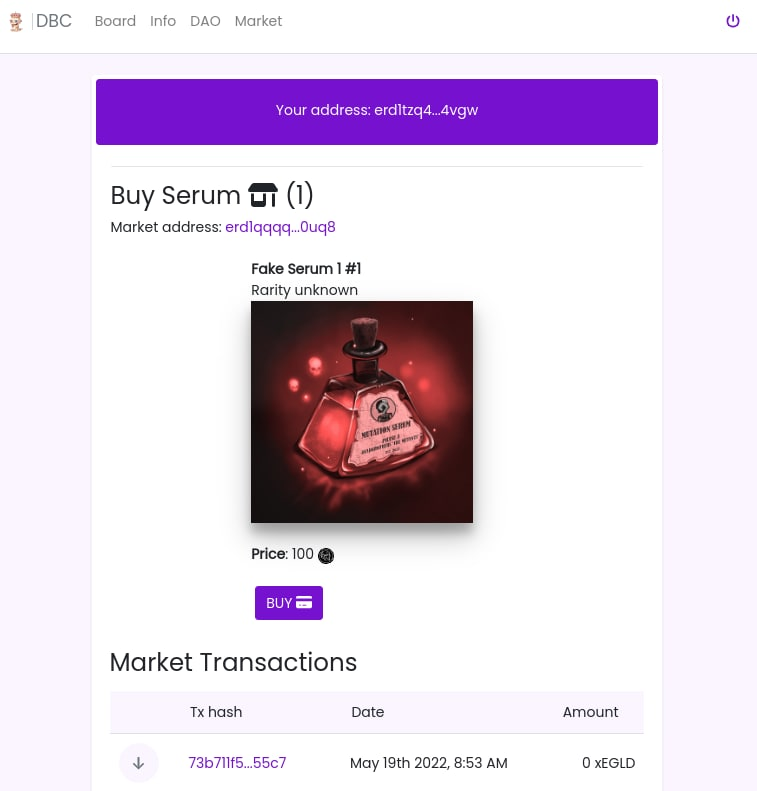

Smart Contract Elrond en Rust : NFT market
###########################################

:date: 2022-07-07
:tags: elrond,rust, nft, market
:category: Rust
:slug: elrond-sc-rust-nft-market
:authors: Morgan
:summary: Smart Contract Elrond en Rust : NFT market

.. image:: ./images/elrond.png
    :alt: Elrond
    :align: right

C'est parti pour le troisième épisode de la série sur les Smart Contracts `Elrond <https://elrond.com/>`_
en `Rust <https://rust-lang.org/>`_. Après avoir vu comment `staker un NFT <http://dotmobo.xyz/elrond-sc-rust-nft-staking.html#elrond-sc-rust-nft-staking>`_ pour gagner des $DEAD et comment
utiliser ces $DEAD pour `voter dans notre DAO <http://dotmobo.xyz/elrond-sc-rust-dao-vote.html#elrond-sc-rust-dao-vote>`_, on va pouvoir désormais acheter des NFTs sur notre propre
*marketplace* avec des $DEAD.

Contexte
--------

On doit pouvoir envoyer des NFTs sur un Smart Contract pour ainsi les vendre avec notre propre ESDT,
ici $DEAD.

C'est une version très simplifié d'un *marketplace* dans le sens où :

* on ne va pouvoir vendre les NFTs que d'une seule collection à la fois.
* le prix de chaque NFT sera identique.

Si on veut avoir des prix différents ou utiliser une autre collection, il faudra soit changer les paramètres
du Smart Contract, soit déployer un autre Smart Contract.

Dans ta **dapp**, ça pourra donner quelque-chose comme ça :

Smart Contract
--------------

Comme d'habitude, on crée un SC vide à l'aide de **erdpy**.

.. code-block:: bash

    erdpy contract new market --template empty

Et on passe directement à l'écriture du SC dans **src/empty.rs**. Notre fonction d'initialisation
va prendre en paramètre l'identifiant du token à utiliser pour les paiements, le prix d'un NFT ainsi
que l'identifiant de la collection de NFT que l'on souhaite vendre.

.. code-block:: rust

    #![no_std]

    elrond_wasm::imports!();

    /// An empty contract. To be used as a template when starting a new contract from scratch.
    #[elrond_wasm::contract]
    pub trait EmptyContract {
        #[init]
        fn init(&self, token_id: TokenIdentifier, price: BigUint, nft_identifier: TokenIdentifier) {
            self.token_id().set(&token_id);
            self.price().set(&price);
            self.nft_identifier().set(&nft_identifier);
            if self.bank().is_empty() {
                self.bank().set(BigUint::from(0u32));
            }
        }
    }

On ajoute dans notre **trait** les **storage_mapper** et **view** des différentes variables que l'on va stocker dans le SC.
L'élément **bank** correspond au montant total de $DEAD que l'on a dans notre SC suite aux divers paiements réalisés.

.. code-block:: rust

    #[view(getBank)]
    #[storage_mapper("bank")]
    fn bank(&self) -> SingleValueMapper<BigUint>;

    #[view(getTokenId)]
    #[storage_mapper("token_id")]
    fn token_id(&self) -> SingleValueMapper<TokenIdentifier>;

    #[view(getNftIdentifier)]
    #[storage_mapper("nft_identifier")]
    fn nft_identifier(&self) -> SingleValueMapper<TokenIdentifier>;

    #[view(getPrice)]
    #[storage_mapper("price")]
    fn price(&self) -> SingleValueMapper<BigUint>;

Ensuite, on ajoute quelques petites fonctions utilitaires pour l'administrateur du SC.
On lui donne la possibilité de récupérer tous les fonds de la banque, de changer le prix de vente des NFTs
ou de changer l'identifiant de la collection de NFT que l'on souhaite vendre. Attention à ne pas oublier le
**only_owner**, sinon n'importe qui pourrait appeler ces fonctions !

.. code-block:: rust

    #[only_owner]
    #[endpoint]
    fn withdraw(&self) -> SCResult<()> {

        let caller = self.blockchain().get_caller();
        let token_id = self.token_id().get();
        let bank = self.bank().get();

        self.send()
            .direct(&caller, &token_id, 0, &bank, b"withdraw successful");

        // reset the bank
        self.bank().set(BigUint::from(0u32));

        Ok(())
    }

    #[only_owner]
    #[endpoint]
    fn change_price(&self, price: BigUint) -> SCResult<()> {

        self.price().set(&price);

        Ok(())
    }

    #[only_owner]
    #[endpoint]
    fn change_nft_identifier(&self, nft_identifier: TokenIdentifier) -> SCResult<()> {

        self.nft_identifier().set(&nft_identifier);

        Ok(())
    }

Enfin, on a la fonction principale de notre SC qui permet d'acheter des NFTs.
On vérifie ici le type du token, le montant envoyé et l'identifiant de la collection de NFT.
Le **nonce** envoyé en paramètre correspond au numéro du NFT que l'utilisateur veut acheter.
Si tout est bon, on lui envoie le NFT via la fonction **self.send().direct()** et on incrémente la banque.

.. code-block:: rust

    #[payable("*")]
    #[endpoint]
    fn buy(
        &self,
        #[payment_token] payment_token: TokenIdentifier,
        #[payment_amount] payment_amount: BigUint,
        nft_identifier: TokenIdentifier,
        nft_nonce: u64,
    ) -> SCResult<()> {
        require!(
            payment_token == self.token_id().get(),
            "Invalid payment token"
        );

        require!(
            payment_amount == self.price().get(),
            "Invalid payment amount"
        );

        require!(
            nft_identifier == self.nft_identifier().get(),
            "Invalid nft identifier"
        );

        let caller = self.blockchain().get_caller();

        let amount = BigUint::from(1u32);
        self.send().direct(&caller, &nft_identifier, nft_nonce, &amount , b"purchase successful");

        // Add the amount to the bank
        let bank = self.bank().get();
        self.bank().set(&bank + &payment_amount);

        Ok(())
    }

Tu compiles ton SC avec **erdpy** pour vérifier que tout est ok :

.. code-block:: bash

    erdpy contract build

Tu peux trouver le résultat final `ici <https://github.com/dotmobo/dbc-dashboard/blob/master/contract/buy_serum/src/empty.rs>`_.

Déploiement
------------

Comme dans les précédents épisodes, tu configures ton fichier **erdpy.json** pour déployer le SC
sur devnet en lui passant les bons arguments. Le SC doit être payable via **"metadata-payable": true** et
le **pem** de ton **wallet** doit se trouver sur **../../wallet/wallet-owner.pem**.

Concernant les arguments, **DEADBROS-fa8f0f** correspond à l'identifiant du token, **100000000000000000000**
au prix d'un NFT avec 18 decimals et **DEAD1-2d86a5** est l'id de la collection de NFT à vendre.

.. code-block:: json

    {
        "configurations": {
            "default": {
                "proxy": "https://devnet-api.elrond.com",
                "chainID": "D"
            }
        },
        "contract":{
            "deploy":{
                "verbose": true,
                "bytecode": "output/buy_serum.wasm",
                "recall-nonce": true,
                "metadata-payable": true,
                "pem": "../../wallet/wallet-owner.pem",
                "gas-limit": 59999999,
                "arguments": [
                    "str:DEADBROS-fa8f0f",
                    "100000000000000000000",
                    "str:DEAD1-2d86a5"
                ],
                "send": true,
                "outfile": "deploy-testnet.interaction.json"
            },
            "upgrade":{
                "verbose": true,
                "bytecode": "output/buy_serum.wasm",
                "recall-nonce": true,
                "metadata-payable": true,
                "pem": "../../wallet/wallet-owner.pem",
                "gas-limit": 59999999,
                "arguments": [
                    "str:DEADBROS-fa8f0f",
                    "100000000000000000000",
                    "str:DEAD1-2d86a5"
                ],
                "send": true,
                "outfile": "deploy-testnet.interaction.json"
            }
        }
    }

Tu peux alors déployer ton SC et tester les transactions avec **erdpy**.

.. code-block:: bash

    erdpy contract deploy
    erdpy tx new --help

N'oublie pas d'envoyer les NFTs que tu souhaites vendre à l'adresse de ton SC !