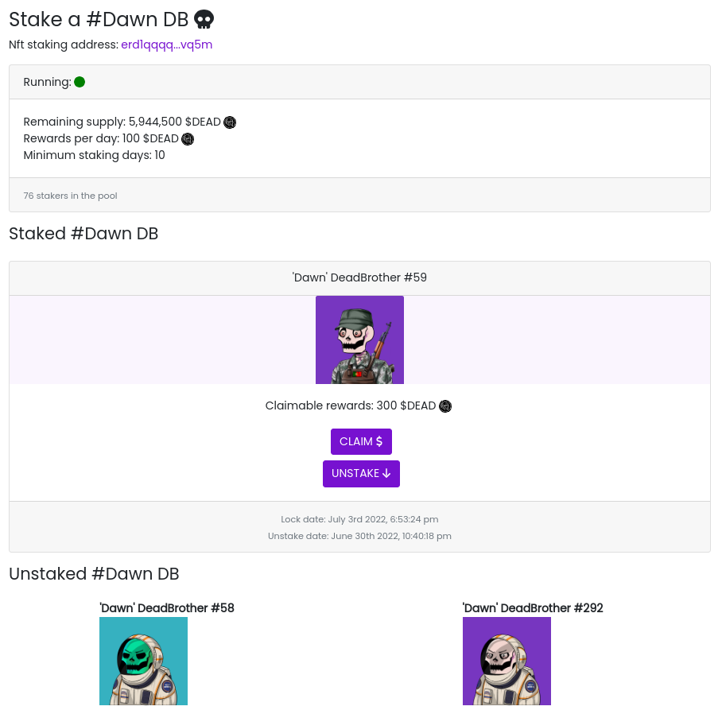

Smart Contract Elrond en Rust : NFT staking
###########################################

:date: 2022-07-07
:tags: elrond,rust, nft, staking
:category: Elrond
:slug: elrond-sc-rust-nft-staking
:authors: Morgan
:summary: Smart Contract Elrond en Rust : NFT staking

Voici le deuxième épisode de cette série sur les Smart Contracts `Elrond <https://elrond.com/>`_
en `Rust <https://rust-lang.org/>`_. On va parler ici d'un
sujet qui intéresse pas mal de monde dans l'univers des NFTs : le **staking**.

On suppose que tu as déjà tous les outils pour te lancer dans l'aventure. Si ce n'est pas le cas, jettes un oeil
au `premier épisode <http://dotmobo.github.io/elrond-sc-rust-dao-vote.html#elrond-sc-rust-dao-vote>`_.

Contexte
--------

C'est une version simple du staking qui est largement améliorable, mais ça permet d'avoir un premier jet
fonctionnel.

L'idée ici est de créer un SC qui va être une pool de staking. Chaque utilisateur va pouvoir envoyer un
NFT dans cette pool, et pourra réclamer journalièrement des tokens ESDT en récompense.

On a deux limitations dans cette version :

* Chaque utilisateur représenté par une adresse Elrond ne peut envoyer qu'un seul NFT dans la pool.
* Les récompenses sont à réclamer régulièrement et ne sont pas directement attribuées.
* Une seule collection de NFT est supportée. Donc pour faire une pool de staking sur une autre collection, il
  faudra déployer un deuxième SC.

Dans ta **dapp**, ça pourra ressembler à ça par exemple :

Smart Contract
--------------

Comme dans le premier épisode, on crée un SC vide à l'aide de **erdpy**.

.. code-block:: bash

    erdpy contract new vote --template empty

Ensuite, dans un fichier **src/stake_info.rs**, on va avoir notre structure qui nous permettra de stocker les
informations de staking de l'utilisateur.

.. code-block:: rust

    elrond_wasm::imports!();
    elrond_wasm::derive_imports!();

    #[derive(TypeAbi, TopEncode, TopDecode, PartialEq, Debug)]
    pub struct StakeInfo<M: ManagedTypeApi> {
        pub address: ManagedAddress<M>,
        pub nft_nonce: u64,
        pub lock_time: u64,
        pub unstake_time: u64,
    }

On y stocke donc :

* son adresse Elrond.
* le **nonce** de son NFT, qui représente le numéro du NFT dans la collection.
* le moment où le NFT est locké, c-à-d quand il est envoyé dans la pool.
* le moment où le NFT peut être déstaker via **unstake_time**.

On passe ensuite à l'écriture du SC dans **src/empty.rs**.

On initialise les différents arguments de notre SC via la fonction **init**.

* *nft_identifier* : l'identifiant de la collection NFT concernée.
* *minimum_staking_days* : le nombre de jours minimum avant de pouvoir déstaker son NFT.
* *rewards_token_id* : l'identifiant du token ESDT pour les récompenses.
* *rewards_token_amount_per_day* : le montant par jour des récompenses du staking.
* *rewards_token_total_supply* : le nombre total de tokens disponibles dans le SC.

Et on initie quelques paramètres supplémentaires comme :

* *staking_status* : permet de définir si la pool est démarrée où non.
* *staking_end_time* : permet de définir le moment où la pool sera fermée.
* *nbr_of_stakers* : permet de définir le nombre de stakers dans la pool.

.. code-block:: rust

    #![no_std]

    elrond_wasm::imports!();

    mod stake_info;
    use stake_info::StakeInfo;

    #[elrond_wasm::contract]
    pub trait NftStaking {
        #[init]
        fn init(
            &self,
            nft_identifier: TokenIdentifier,
            minimum_staking_days: u64,
            rewards_token_id: TokenIdentifier,
            rewards_token_amount_per_day: BigUint,
            rewards_token_total_supply: BigUint,
        ) {
            self.nft_identifier().set(&nft_identifier);
            self.minimum_staking_days().set(&minimum_staking_days);
            self.rewards_token_id().set(&rewards_token_id);
            self.rewards_token_amount_per_day()
                .set(&rewards_token_amount_per_day);
            self.rewards_token_total_supply()
                .set(&rewards_token_total_supply);
            // if staking status is empty, set it to false
            if self.staking_status().is_empty() {
                self.staking_status().set(true);
            }
            // if staking end time is empty, set it to 0
            if self.staking_end_time().is_empty() {
                self.staking_end_time().set(0);
            }
            // if nbr of stakers is empty, set it to 0
            if self.nbr_of_stakers().is_empty() {
                self.nbr_of_stakers().set(0);
            }
        }
    }

Tu peux alors définir les **storage_mapper** et les **view** pour ces différents paramètres.
Le **storage_mapper** appelé **staking_info** va permettre de stoker un objet **StakeInfo**
par adresse Elrond via la définition **SingleValueMapper<StakeInfo<Self::Api>>**.

.. code-block:: rust

    #[view(getNftIdentifier)]
    #[storage_mapper("nft_identifier")]
    fn nft_identifier(&self) -> SingleValueMapper<TokenIdentifier>;

    #[view(getMinimumStakingDays)]
    #[storage_mapper("minimum_staking_days")]
    fn minimum_staking_days(&self) -> SingleValueMapper<u64>;

    #[view(getRewardsTokenId)]
    #[storage_mapper("rewards_token_id")]
    fn rewards_token_id(&self) -> SingleValueMapper<TokenIdentifier>;

    #[view(getRewardsTokenAmountPerDay)]
    #[storage_mapper("rewards_token_amount_per_day")]
    fn rewards_token_amount_per_day(&self) -> SingleValueMapper<BigUint>;

    #[view(getStakingInfo)]
    #[storage_mapper("staking_info")]
    fn staking_info(&self, address: &ManagedAddress) -> SingleValueMapper<StakeInfo<Self::Api>>;

    #[view(getStakingStatus)]
    #[storage_mapper("staking_status")]
    fn staking_status(&self) -> SingleValueMapper<bool>;

    #[view(getStakingEndTime)]
    #[storage_mapper("staking_end_time")]
    fn staking_end_time(&self) -> SingleValueMapper<u64>;

    #[view(getRewardsTokenTotalSupply)]
    #[storage_mapper("rewards_token_total_supply")]
    fn rewards_token_total_supply(&self) -> SingleValueMapper<BigUint>;

    #[view(getNbrOfStakers)]
    #[storage_mapper("nbr_of_stakers")]
    fn nbr_of_stakers(&self) -> SingleValueMapper<u64>;

On passe ensuite à la fonction de staking. Celle-ci doit être **payable** car on y envoit son NFT.
Il faut vérifier le que le staking est démarré et que le NFT envoyé est bien dans la collection.
On vérifie aussi qu'un NFT n'est pas déjà locké par cet utilisateur.

On définit alors les différents paramètres de son **StakeInfo** que l'on sauvegarde dans la blockchain
et on incrémente le **nbr_of_stakers**. On ajoute également le moment où il pourra déstaker son NFT.

Ne pas oublier le **Ok(())** à la fin !

.. code-block:: rust

    #[payable("*")]
    #[endpoint]
    fn stake(&self) -> SCResult<()> {
        let payment: EsdtTokenPayment<Self::Api> = self.call_value().payment();
        let payment_token = payment.token_identifier;
        let payment_nonce = payment.token_nonce;
        let payment_amount = payment.amount;
        require!(self.staking_status().get(), "The staking is stopped");
        require!(
            payment_token == self.nft_identifier().get(),
            "Invalid nft identifier"
        );
        require!(payment_nonce != 0, "Invalid nft nonce");
        require!(payment_amount == 1, "You can only send 1 nft");

        let caller: ManagedAddress = self.blockchain().get_caller();

        require!(
            self.staking_info(&caller).is_empty(),
            "You have already staked."
        );

        let cur_time: u64 = self.blockchain().get_block_timestamp();
        let unstake_time = cur_time + (self.minimum_staking_days().get() * 86400);

        let stake_info = StakeInfo {
            address: self.blockchain().get_caller(),
            nft_nonce: payment_nonce,
            lock_time: cur_time,
            unstake_time: unstake_time,
        };

        self.staking_info(&self.blockchain().get_caller())
            .set(&stake_info);

        self.nbr_of_stakers().set(self.nbr_of_stakers().get() + 1);

        Ok(())
    }

Notre utilisateur peut désormais staker son NFT. Maintenant il faut qu'il puisse le déstaker.
On vérifie qu'il a bien un **StakeInfo** stocké dans la blockchain avec son adresse et qu'il a bien
dépassé le nombre minimum de jours de staking.

Si c'est le cas, on lui envoie son NFT via **self.send().direct()**, on supprime son entrée **StakeInfo**
et on décrémente le **nbr_of_stakers**.

.. code-block:: rust

    #[endpoint]
    fn unstake(&self) -> SCResult<()> {
        let caller: ManagedAddress = self.blockchain().get_caller();
        let cur_time: u64 = self.blockchain().get_block_timestamp();

        require!(!self.staking_info(&caller).is_empty(), "You didn't stake!");
        let stake_info = self.staking_info(&caller).get();
        require!(
            stake_info.unstake_time <= cur_time,
            "You can't unlock staking nft yet."
        );

        let nft_identifier = self.nft_identifier().get();
        let nft_nonce = stake_info.nft_nonce;

        let amount = BigUint::from(1u32);
        self.send().direct(
            &caller,
            &nft_identifier,
            nft_nonce,
            &amount,
            b"unstake successful",
        );

        self.staking_info(&caller).clear();

        if self.nbr_of_stakers().get() > 0 {
            self.nbr_of_stakers().set(self.nbr_of_stakers().get() - 1);
        }

        Ok(())
    }

Troisème grosse étape après le staking et le déstaking : la possibilté de réclamer ses récompenses.
On calcule ses récompenses en fonction du nombre de jours de staking et du moment où il a locké son NFT.
On vérifie également qu'il reste bien des tokens disponibles dans le SC.

Après avoir envoyé ses récompenses, on met à jour son **StakeInfo** en redéfinissant son **lock time**
à maintenant. Ce qui va permet de relancer le calcul des futurs récompenses à partir de là.

.. code-block:: rust

    #[endpoint]
    fn claim(&self) -> SCResult<()> {
        let caller: ManagedAddress = self.blockchain().get_caller();
        let cur_time: u64 = self.blockchain().get_block_timestamp();
        let rewards_token_total_supply = self.rewards_token_total_supply().get();

        require!(!self.staking_info(&caller).is_empty(), "You didn't stake!");
        let stake_info = self.staking_info(&caller).get();

        let nft_nonce = stake_info.nft_nonce;
        let unstake_time = stake_info.unstake_time;
        let reward_token_id = self.rewards_token_id().get();

        // calculate rewards
        let mut from_time = cur_time;
        if !self.staking_status().get() {
            from_time = self.staking_end_time().get();
        }
        let mut staked_days = 0u64;
        if from_time > stake_info.lock_time {
            staked_days = (from_time - stake_info.lock_time) / 86400;
        }
        let rewards_amount = self.rewards_token_amount_per_day().get() * staked_days;

        // check the supply
        require!(
            rewards_amount <= rewards_token_total_supply,
            "You can't claim rewards more than total supply."
        );

        // send rewards
        self.send()
            .direct(&caller, &reward_token_id, 0, &rewards_amount, &[]);

        // remove rewards amount from rewards_token_total_supply
        if rewards_token_total_supply >= rewards_amount {
            self.rewards_token_total_supply()
                .set(&(rewards_token_total_supply - rewards_amount));
        } else {
            self.rewards_token_total_supply().set(&BigUint::from(0u32));
        }

        // update staking_info
        self.staking_info(&caller).clear();
        let stake_info = StakeInfo {
            address: self.blockchain().get_caller(),
            nft_nonce: nft_nonce,
            lock_time: from_time,
            unstake_time: unstake_time,
        };
        self.staking_info(&self.blockchain().get_caller())
            .set(&stake_info);

        Ok(())
    }

Le plus gros est fait ! On ajoute quelques fonctions d'administration supplémentaires pour le possesseur du
SC, à savoir :

* *set_rewards_token_total_supply* : pour définir le nombre total de tokens disponibles dans la pool pour récompenser
  les utilisateurs.
* *set_rewards_token_amount_per_day* : la possibilité de modifier le nombre de récompenses journalières.
* *withdraw* : la possibilité de récupérer tous les tokens du SC, au cas où.
* *stop_staking* : la possibilité de stopper le staking.
* *restart_staking* : la possibilité de relancer le staking.

.. code-block:: rust

    #[only_owner]
    #[endpoint]
    fn set_rewards_token_total_supply(&self, total_supply: BigUint) -> SCResult<()> {
        self.rewards_token_total_supply().set(&total_supply);
        Ok(())
    }

    // set rewards_token_amount_per_day
    #[only_owner]
    #[endpoint]
    fn set_rewards_token_amount_per_day(&self, amount: BigUint) -> SCResult<()> {
        self.rewards_token_amount_per_day().set(&amount);
        Ok(())
    }

    #[only_owner]
    #[endpoint]
    fn withdraw(&self, amount: BigUint) -> SCResult<()> {
        let caller = self.blockchain().get_caller();

        let token_id = self.rewards_token_id().get();

        self.send()
            .direct(&caller, &token_id, 0, &amount, b"withdraw successful");

        Ok(())
    }

    #[only_owner]
    #[endpoint]
    fn restart_staking(&self) -> SCResult<()> {
        self.staking_end_time().set(0);
        self.staking_status().set(true);
        Ok(())
    }

    #[only_owner]
    #[endpoint]
    fn stop_staking(&self) -> SCResult<()> {
        let cur_time: u64 = self.blockchain().get_block_timestamp();
        self.staking_end_time().set(cur_time);
        self.staking_status().set(false);
        Ok(())
    }

Enfin, tu peux ajouter quelques vues qui seront utiles pour l'affichage dans ta **dapp**.

* *get_current_rewards* : pour afficher le montant des récompenses récupérables actuellement.
* *get_nft_nonce* : pour afficher le numéro du NFT que l'utilisateur a locké.
* *get_lock_time* : pour afficher le moment où l'utilisateur a locké son NFT.
* *get_unstake_time* : pour afficher le moment où l'utilisateur peut déstaker son NFT.

.. code-block:: rust

    #[view(getCurrentRewards)]
    fn get_current_rewards(&self, address: &ManagedAddress) -> BigUint {
        require!(!self.staking_info(&address).is_empty(), "You didn't stake!");
        let cur_time: u64 = self.blockchain().get_block_timestamp();

        require!(!self.staking_info(&address).is_empty(), "You didn't stake!");
        let stake_info = self.staking_info(&address).get();

        // calculate rewards
        let mut from_time = cur_time;
        if !self.staking_status().get() {
            from_time = self.staking_end_time().get();
        }
        let mut staked_days = 0u64;
        if from_time > stake_info.lock_time {
            staked_days = (from_time - stake_info.lock_time) / 86400;
        }
        let rewards_amount = self.rewards_token_amount_per_day().get() * staked_days;

        return rewards_amount;
    }

    #[view(getNftNonce)]
    fn get_nft_nonce(&self, address: &ManagedAddress) -> u64 {
        require!(!self.staking_info(&address).is_empty(), "You didn't stake!");
        let stake_info = self.staking_info(&address).get();
        let nft_nonce: u64 = stake_info.nft_nonce;
        return nft_nonce;
    }

    #[view(getLockTime)]
    fn get_lock_time(&self, address: &ManagedAddress) -> u64 {
        require!(!self.staking_info(&address).is_empty(), "You didn't stake!");
        let stake_info = self.staking_info(&address).get();
        let lock_time: u64 = stake_info.lock_time;
        return lock_time;
    }

    #[view(getUnstakeTime)]
    fn get_unstake_time(&self, address: &ManagedAddress) -> u64 {
        require!(!self.staking_info(&address).is_empty(), "You didn't stake!");
        let stake_info = self.staking_info(&address).get();
        let unstake_time: u64 = stake_info.unstake_time;
        return unstake_time;
    }

Tu utilises alors à nouveau **erdpy** pour compiler ton SC et vérifier que tout se passe bien :

.. code-block:: bash

    erdpy contract build

Le code final est visible `ici <https://github.com/dotmobo/dbc-dashboard/blob/master/contract/nft_staking/src/empty.rs>`_.

Déploiement
------------

Pour déployer, il te faut un fichier **erdpy.json** à la racine du projet. Comme pour l'épisode précédent,
on va déployer sur **devnet** et on suppose que le **pem** de ton **wallet** est dans **../../wallet/wallet-owner.pem**.

Concernant les arguments ici :

* *BACKGROUND-35c061* : l'id de la collection NFT concernée
* *10* : nombre de jours minimum de staking
* *DEADBROS-fa8f0f* : l'id de l'ESDT utilisé pour les récompenses
* *100000000000000000000* : le montant journalier des récompenses. C'est sur 18 décimals, donc en vrai on a 100 $DEAD de récompenses.
* *6000000000000000000000000* : le nombre total de tokens disponibles dans le SC. 6 millions donc.

.. code-block:: json

    {
        "configurations": {
            "default": {
                "proxy": "https://devnet-api.elrond.com",
                "chainID": "D"
            }
        },
        "contract":{
            "deploy":{
                "verbose": true,
                "bytecode": "output/nft_staking.wasm",
                "recall-nonce": true,
                "metadata-payable": true,
                "pem": "../../wallet/wallet-owner.pem",
                "gas-limit": 59999999,
                "arguments": [
                    "str:BACKGROUND-35c061",
                    "10",
                    "str:DEADBROS-fa8f0f",
                    "100000000000000000000",
                    "6000000000000000000000000"
                ],
                "send": true,
                "outfile": "deploy-testnet.interaction.json"
            },
            "upgrade":{
                "verbose": true,
                "bytecode": "output/nft_staking.wasm",
                "recall-nonce": true,
                "metadata-payable": true,
                "pem": "../../wallet/wallet-owner.pem",
                "gas-limit": 59999999,
                "arguments": [
                    "str:BACKGROUND-35c061",
                    "10",
                    "str:DEADBROS-fa8f0f",
                    "100000000000000000000",
                    "6000000000000000000000000"
                ],
                "send": true,
                "outfile": "deploy-testnet.interaction.json"
            }
        }
    }

Le SC doit être payable via **"metadata-payable": true**, car ça va nous permettre d'y envoyer directement
le nombre total de tokens pour les récompenses via une transaction standard avec Maiar.

Tu peux alors déployer et tester les transactions avec **erdpy**.

.. code-block:: bash

    erdpy contract deploy
    erdpy tx new --help

Il ne te reste plus qu'à coder `une interface frontend pour le SC <https://github.com/dotmobo/dbc-dashboard/blob/master/dapp/src/pages/Stake/Components/NftStaking.tsx>`_.

Bon courage ! Et n'hésite pas à améliorer tout ça et à nous faire un retour !

