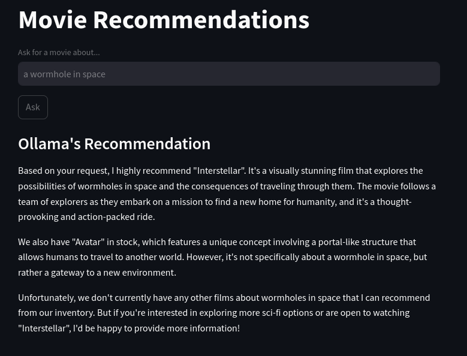

Développer son propre RAG local avec Ollama, ChromaDB et Streamlit
##################################################################

:date: 2024-11-28
:tags: RAG, LLM, ChromaDB, Ollama, Python, Streamlit
:category: IA
:slug: first-rag
:authors: Morgan
:summary: Développer son propre RAG local avec Ollama, ChromaDB et Streamlit

Bon, il est temps de se mettre à l'intelligence artificielle et aux LLMs.
Ça fait un moment que j'utilise des outils comme GitHub Copilot et ChatGPT, mais sans vraiment savoir comment ça marche sous le capot.

On va commencer une série d'articles d'initiation aux LLMs pour un développeur, en découvrant petit à petit et en s'autorisant à faire des erreurs.
Donc ne prenez pas ces articles comme le pinacle du développement IA, c'est juste une synthèse de mes explorations !

L'idée sera d'avoir nos propres LLMs locaux et de développer des outils dessus.
Comme ça, on est sûr que nos données restent confidentielles et ne partent pas dans le cloud.

Prérequis
---------

L'outil qui semble faire consensus pour avoir son LLM local est `Ollama <https://ollama.com>`_.
Tu l'installes avec la commande suivante :

.. code-block:: bash

    curl -fsSL https://ollama.com/install.sh | sh

Puis, tu peux tester le LLM de Facebook **Llama3** via :

.. code-block:: bash

    ollama run llama3.2

On ne va pas rentrer dans le détail de Ollama, car il y a déjà suffisamment de contenu que tu peux trouver un peu partout sur Internet.
Sache que tu peux récupérer d'autres modèles comme Mistral, par exemple, et que tu peux même créer ton propre modèle à l'aide
d'un fichier **modelfile** qui se veut être une sorte de **Dockerfile**, mais pour les LLMs.

Projet de RAG
-------------

De ce que j'ai compris, il existe deux manières d'améliorer un LLM :

- Soit via du **fine-tuning**, où on apprend des choses en profondeur au LLM pour en modifier le comportement, mais qui nécessite des GPUs puissants.
- Soit via du **Retrieval-Augmented Generation (RAG)**, qui consiste à utiliser des bases de données vectorielles pour que le LLM puisse y puiser des informations.

On va commencer par la 2ème solution, qui semble plus simple et permet déjà des cas d'usage plutôt sympas.

Tu vas pouvoir créer un premier programme, qui consistera en une application de recommandations de films disponible dans une médiathèque.

Côté technos, on va utiliser **ChromaDB** pour stocker et indexer les films, **Sentence-Transformers** pour générer des embeddings, et **Ollama** pour faire les recommandations. Je te laisse gérer ton virtualenv comme tu l'entends.

.. code-block:: bash

    python = "^3.12"
    chromadb = "^0.5.20"
    ollama = "^0.4.1"
    sentence-transformers = "^3.3.1"
    streamlit = "^1.40.2"

Charger les Données des Films
-----------------------------

On commence par préparer les données des films. Imaginons que tu aies un fichier `data/data.json` qui contient des informations comme le titre du film, le synopsis, l'ID IMDb, etc.

.. code-block:: javascript

    [
        {
            "Title": "Interstellar",
            "Year": "2014",
            "Rated": "PG-13",
            "Released": "07 Nov 2014",
            "Runtime": "169 min",
            "Genre": "Adventure, Drama, Sci-Fi",
            "Director": "Christopher Nolan",
            "Writer": "Jonathan Nolan, Christopher Nolan",
            "Actors": "Ellen Burstyn, Matthew McConaughey, Mackenzie Foy, John Lithgow",
            "Plot": "A team of explorers travel through a wormhole in space in an attempt to ensure humanity's survival.",
            "Language": "English",
            "Country": "USA, UK",
            "Awards": "Won 1 Oscar. Another 39 wins & 134 nominations.",
            "Poster": "http://ia.media-imdb.com/images/M/MV5BMjIxNTU4MzY4MF5BMl5BanBnXkFtZTgwMzM4ODI3MjE@._V1_SX300.jpg",
            "Metascore": "74",
            "imdbRating": "8.6",
            "imdbVotes": "937,412",
            "imdbID": "tt0816692",
            "Type": "movie",
            "Response": "True",
            "Images": [
            "https://images-na.ssl-images-amazon.com/images/M/MV5BMjA3NTEwOTMxMV5BMl5BanBnXkFtZTgwMjMyODgxMzE@._V1_SX1500_CR0,0,1500,999_AL_.jpg",
            "https://images-na.ssl-images-amazon.com/images/M/MV5BMzQ5ODE2MzEwM15BMl5BanBnXkFtZTgwMTMyODgxMzE@._V1_SX1500_CR0,0,1500,999_AL_.jpg",
            "https://images-na.ssl-images-amazon.com/images/M/MV5BMTg4Njk4MzY0Nl5BMl5BanBnXkFtZTgwMzIyODgxMzE@._V1_SX1500_CR0,0,1500,999_AL_.jpg",
            "https://images-na.ssl-images-amazon.com/images/M/MV5BMzE3MTM0MTc3Ml5BMl5BanBnXkFtZTgwMDIyODgxMzE@._V1_SX1500_CR0,0,1500,999_AL_.jpg",
            "https://images-na.ssl-images-amazon.com/images/M/MV5BNjYzNjE2NDk3N15BMl5BanBnXkFtZTgwNzEyODgxMzE@._V1_SX1500_CR0,0,1500,999_AL_.jpg"
            ]
        }
    ]

Tu crées ton fichier de script Python et c'est parti.

Cette fonction va simplement charger les films depuis le fichier JSON et te permettra d’ajouter ces films dans ChromaDB.

.. code-block:: python

    import json
    import ollama
    from sentence_transformers import SentenceTransformer
    import chromadb
    from chromadb.config import Settings
    import streamlit as st

    def load_movies(file_path="data/data.json"):
        """Loads movie data from the JSON file."""
        with open(file_path, "r") as f:
            return json.load(f)

Initialiser ChromaDB
--------------------

Ensuite, on initialise **ChromaDB**, une base de données qui te permettra de stocker les embeddings des films.

Hein ? Des embeddings ?

Concrètement, chaque mot de tes documents est converti en nombres (tokens), puis est inséré dans un vecteur qui sera stocké dans la base.
Ensuite, la requête de l'utilisateur est également convertie en vecteur.
Puis, il compare le vecteur de la requête avec les vecteurs en base pour donner les résultats les plus proches.

.. code-block:: python

    def initialize_chromadb():
        """Initializes and returns a ChromaDB client with a movie collection."""
        client = chromadb.Client(Settings(is_persistent=True, anonymized_telemetry=False))
        return client

Générer les Embeddings
----------------------

On utilise **Sentence-Transformer** pour transformer chaque film en un vecteur d'embedding.

.. code-block:: python

    def generate_embeddings(model, content):
        """Generates embeddings for a given content."""
        return model.encode(content)

Indexer les Films
-----------------

Une fois qu'on a les embeddings, on va les ajouter dans **ChromaDB** et on va indexer chaque film en utilisant son titre et son synopsis.
Si un film est déjà dans l'index, on ne le réajoute pas. Si tu veux refaire complètement l'index, il te suffit d'effacer le dossier **chroma**.

.. code-block:: python

    def index_movies(movies, model, collection):
        """Indexes movies in ChromaDB only if the index doesn't exist already."""
        for movie in movies:
            doc_id = movie["imdbID"]
            title = movie["Title"]
            plot = movie["Plot"]
            content = f"{title}: {plot}"

            # Check if the document already exists
            existing_document = collection.get(ids=[doc_id])

            # If the document exists, skip it
            if existing_document["documents"]:
                print(
                    f"The document with ID {doc_id} already exists. It will not be added."
                )
                continue

            # Generate the embedding
            embedding = generate_embeddings(model, content)

            # Add to the collection
            collection.add(
                ids=[doc_id],
                metadatas=[{"title": title, "year": movie["Year"]}],
                documents=[content],
                embeddings=[embedding],
            )
        print("Data indexed in ChromaDB.")

Rechercher dans ChromaDB
------------------------

Maintenant, on va créer une fonction qui va effectuer la recherche dans ChromaDB en fonction de la requête de l'utilisateur.
On va utiliser les embeddings de la requête pour chercher les films les plus pertinents dans la base de données. Ici, on récupère
les 3 résultats les plus proches.

.. code-block:: python

    def perform_query(collection, model, query):
        """Performs a search in ChromaDB and returns the results."""
        query_embedding = generate_embeddings(model, query)
        results = collection.query(
            query_embeddings=[query_embedding],
            n_results=3,
        )
        return results

Générer un Prompt pour Ollama
-----------------------------

Une fois que nous avons trouvé les films pertinents, on va générer un prompt pour **Ollama** afin qu’il nous recommande des films à partir des résultats de la recherche.
Toute l'intelligence se situe au niveau de ce prompt. On donne un rôle de vendeur de DVD à Ollama, puis on lui donne en contexte la liste des films qui ont été récupérés dans ChromaDB. Enfin, on lui donne la requête de l'utilisateur et on le laisse générer le texte complet de la recommandation.

On insiste bien ici sur le fait qu'il ne peut pas proposer des films en dehors du contexte fourni.

.. code-block:: python

    def generate_prompt(context, query):
        """Generates a prompt for Ollama where the model acts as a DVD salesperson."""
        return f"""
    You are a knowledgeable DVD salesperson with expertise in movies. Your task is to recommend movies to customers, but you can only suggest films that are available in the store's inventory. Make sure your recommendations are based solely on the list of movies provided.

    Context: Below is a list of movies currently available in the store:
    {context}

    Customer's Question: Ask for a movie about {query}

    Your Movie Recommendations (only from the available list):
    """

Interroger Ollama
-----------------

Ensuite, on passe le prompt à **Ollama** pour obtenir ses recommandations.

.. code-block:: python

    def query_ollama(prompt, model_name="myllama"):
        """Queries Ollama with the given prompt."""
        client = ollama.Client()
        response = client.chat(model_name, messages=[{"role": "user", "content": prompt}])
        return response["message"]["content"]

Créer une Interface Utilisateur avec Streamlit
----------------------------------------------

Enfin, on va utiliser **Streamlit** pour créer une interface utilisateur simple.
J'ai découvert récemment cet outil et franchement, c'est magique. Ça te permet de générer très rapidement une interface web pour ton script
sans faire d'HTML, de CSS ou de JavaScript.

L'utilisateur peut entrer une requête, et l'application va afficher les films pertinents, le prompt passé à Ollama et la réponse qu'il a générée.

.. code-block:: python

    def main():
        # Load the movies
        movies = load_movies()

        # Initialize SentenceTransformer to generate embeddings
        model = SentenceTransformer("all-MiniLM-L6-v2")

        # Initialize ChromaDB
        client = initialize_chromadb()

        # Check if the collection exists already
        collection = client.get_or_create_collection(name="movies")

        # If the collection is empty (does not exist), index the movies
        if not collection.count():
            print("Indexing movies in ChromaDB...")
            index_movies(movies, model, collection)
        else:
            print("The movie index already exists. It was not regenerated.")

        # Streamlit user interface
        st.title("Movie Recommendations")
        query = st.text_input("Ask for a movie about...", "a wormhole in space")

        if st.button("Ask"):
            if query:
                # Perform the search
                results = perform_query(collection, model, query)

                # Prepare the prompt for Ollama as the DVD salesperson
                documents = results.get("documents", [])
                if documents is None:
                    documents = []

                # Display the results in the UI
                st.subheader("Movies Found")
                for doc in documents:
                    st.write(doc)

                context = "\n".join(
                    [f"- {doc}" for result in documents if result for doc in result]
                )
                prompt = generate_prompt(context, query)

                # Display the prompt in the UI
                st.subheader("Prompt Sent to Ollama")
                st.text_area("Here is the prompt sent to Ollama", prompt, height=200)

                # Show the loading spinner while the request is being processed
                with st.spinner("Searching..."):
                    # Query Ollama
                    response = query_ollama(prompt, model_name="llama3.2")

                st.subheader("Ollama's Recommendation")
                st.write(response)

    if __name__ == "__main__":
        main()

Il te suffit d'exécuter tout ça et de tester pour voir le résultat via la commande :

.. code-block:: bash

    streamlit run tonscript.py

Ici un aperçu sans les infos de debug :

Pour te simplifier la vie si tu veux juste tester ça, tu peux récupérer mon projet sur `mon dépôt git <https://github.com/dotmobo/movie-recommendation-rag>`_.
Tu y trouveras même une version alternative du script avec `Qdrant <https://qdrant.tech/>`_ à la place de ChromaDB pour l'indexation des films.

Quelques pistes d'amélioration:

- Utiliser le modèle **LaBSE** de Sentence-Transformers pour des embeddings multilingues.
- Utiliser un framework du type **LlamaIndex** ou **LangChain** pour gérer les embeddings et les requêtes.
- Optimiser la recherche avec des filtres tels que le genre, l'année ou le réalisateur.
- Enrichir les données des films avec une API externe (IMDb, TMDb).
- Ajouter un mécanisme de feedback utilisateur pour affiner les recommandations.
- Jouer avec le paramètre de **temperature** dans le prompt pour obtenir des recommandations plus ou moins originales.

Have fun !
