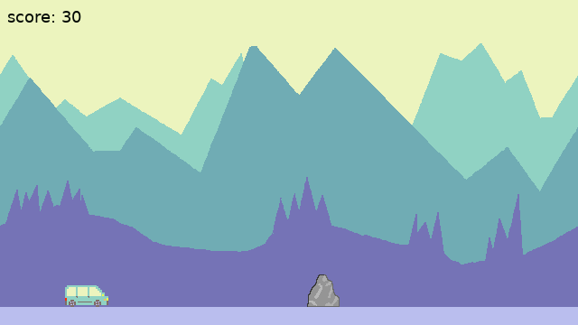

Débuter le développement de jeux vidéos en créant un Infinite Runner en Lua
###########################################################################

:date: 2021-06-16
:tags: jeux,videos,lua,love2d,pico8,runner,itch
:category: Lua
:slug: jeux-videos-lua
:authors: Morgan
:summary: Débuter le développement de jeux vidéos en créant un Infinite Runner en Lua

.. image:: ./images/lua-logo.gif
    :alt: Lua
    :align: right

L'an dernier, principalement pendant la période de confinement, je me suis mis dans l'idée d'expérimenter le développement de jeux vidéos.
C'est un domaine qui m'a toujours attiré et passionné depuis tout petit, mais je n'ai jamais vraiment pris le temps de m'y attarder sérieusement.

Les moteurs de jeux actuels comme l'Unreal Engine ou Unity ne m'attiraient pas vraiment. Ils me donnaient l'impression de devoir apprendre à utiliser un logiciel de
création complexe plutôt que de développer simplement un jeu.

L'idée était de rester au plus simple, au plus rapide et au plus prêt du code. Et donc de pouvoir utiliser le combo Linux + VS Code pour le développement.

Afin de trouver un moteur de jeu qui convenait à mes attentes, je me suis intéressé à l'excellent site `Itch.io <https://itch.io/>`_, qui permet aux développeurs
indépendants de vendre leurs créations et de participer à des *Game Jams*. Pour mes lecteurs musiciens, c'est un peu le `Bandcamp <https://bandcamp.com/>`_ des jeux vidéos. 

Et ce qui est intéressant, c'est qu'il propose une `liste des moteurs de jeux les plus utilisés <https://itch.io/game-development/engines/most-projects>`_ sur sa plateforme.
En éliminant les logiciels de création (Unity, Construct, Game Maker, Unreal Engine, Godot), il nous reste principalement deux moteurs de jeux : 

`LÖVE <https://love2d.org/>`_ et `PICO-8 <https://www.lexaloffle.com/pico-8.php>`_

Ces deux moteurs sont vraiment excellents et on l'avantage d'être basé sur le même langage de programmation, `Lua <http://www.lua.org/>`_.

Lua
---

Lua est un langage de script écrit en C très simple à apprendre et à utiliser. Il permet de faire de la programmation impérative de base, et se situe donc à mi-chemin entre
Python, Go et Shellscript. Il ne faut pas espérer y trouver des concepts très avancés en programmation objet ou fonctionnel.

Néanmoins, il est parfait pour s'initier au développement de jeux vidéos sans avoir de grandes connaissances en programmation en amont.

Ses concepts de base sont bien résumés sur `Learn Lua in Y Minutes <https://learnxinyminutes.com/docs/fr-fr/lua-fr/>`_ et ça ressemble à ça :

.. code-block:: lua

    -- defines a factorial function
    function fact (n)
        if n == 0 then
            return 1
        else
            return n * fact(n-1)
        end
    end

    print("enter a number:")
    a = io.read("*number")        -- read a number
    print(fact(a))

Prends-toi 10 minutes pour te familiariser avec le langage et on peut passer à la suite !

LÖVE
----

.. image:: ./images/love.png
    :alt: Löve
    :align: right

On commence par le moteur LÖVE, qui est un moteur open source, à l'inverse de PICO-8 qui est payant et propriétaire.
Tu l'installes et tu fais le `Getting Started <https://love2d.org/wiki/Getting_Started>`_ du site officiel qui va te permettre que vérifier que tout est ok.

Tout le fonctionnement de LÖVE se situe autour de 3 fonctions principales.

La fonction **load** permet d'initialiser les éléments du jeu une fois au démarrage, comme le chargement d'images ou l'initialisation de variables.
Dans l'exemple ci-dessous, on charge une image et on définit la police de caractères et les couleurs de notre jeu :

.. code-block:: lua

    function love.load()
        image = love.graphics.newImage("cake.jpg")
        love.graphics.setNewFont(12)
        love.graphics.setColor(0,0,0)
        love.graphics.setBackgroundColor(255,255,255)
    end

La fonction **update** est appelée continuellement, comme une boucle infinie, et utilise le **delta time** en paramètre qui représente le temps écoulé entre chaque appel.
C'est ici que l'on va mettre à jour les données de notre jeu. Tu vas pouvoir l'utiliser pour mettre à jour les positions X et Y de ton joueur en fonction de l'appuie
sur une touche par exemple. Ici, on incrémente un nombre lorsque l'on appuie sur *flèche haut* :

.. code-block:: lua

    function love.update(dt)
        if love.keyboard.isDown("up") then
            num = num + 100 * dt -- this would increment num by 100 per second
        end
    end

La fonction **draw** gère l'affichage des éléments, et les met automatiquement à jour lorsque des modifications sont apportées sur la position du joueur dans **update**
par exemple. La séparation de **update** et de **draw** permet d'éviter des soucis de performances. Si des méthodes de calculs prennent beaucoup de temps dans **update**,
ça n'affecte pas l'affichage des éléments dans **draw** et évite des effets de ralentissements.
Ici, on affiche une image en fonction de sa position et du texte.

.. code-block:: lua

    function love.draw()
        love.graphics.draw(image, imgx, imgy)
        love.graphics.print("Click and drag the cake around or use the arrow keys", 10, 10)
    end

Outils
------

Avant de s'attaquer au développement de ton premier jeu, il faut t'équiper de certains outils.

**Pixel Art**

Pour l'instant, on ne s'intéressera qu'aux dessins sous forme de *Pixel Art*. Tu peux utiliser les outils suivants :

- `Piskel <https://www.piskelapp.com/>`_ : Outil en ligne pour faire tes dessins et animations. Parfait pour débuter.
- `Krita <https://krita.org/>`_ : Outil de dessin très populaire sous Linux, qui permet d'utiliser `une brosse spécifique pour le Pixel Art <https://docs.krita.org/en/reference_manual/brushes/brush_engines/pixel_brush_engine.html>`_.
- `Aseprite <https://www.aseprite.org/>`_ : Mon outil préféré, mais payant pour avoir un installateur. Il est néanmoins open source et peut être compilé gratuitement depuis les sources sur Github.

**Musique**

Au niveau du son, tu peux t'équiper des outils suivants :

- `Freesound <https://freesound.org/>`_ : Librarie en ligne de milliers de sons utilisable gratuitement. Parfait pour trouver des musiques et des effets.
- `Audacity <https://audacity.fr/>`_ : Outil d'édition de fichier audio, simple et efficace si tu as besoin de faire des retouches ou d'enregistrer des sons.
- `Jfxr <https://jfxr.frozenfractal.com/>`_ : Successeur de `Bfxr <https://www.bfxr.net/>`_, c'est un outil qui permet de générer aléatoirement des sons 8bits comme le saut, le tir au laser et autres.

**Editeur de cartes**

On ne l'utilisera pas tout suite, mais le meilleur outil pour éditer des niveaux est `Tiled <https://www.mapeditor.org/>`_. Il est gratuit, très populaire et est
compatible avec la plupart des moteurs de jeux. Tu peux déjà y jeter un oeil si ça t'intéresse.

Runner
------

Ma première expérience dans l'utilisation de LÖVE a été la création de ce petit *Infinite Runner* appelé `Multipla Adventure <https://dotmobo.itch.io/multipla-adventure>`_.
Il s'agissait d'un projet inspiré par la destruction du carter d'huile ma Fiat Multipla sur un rocher dans un chemin forestier !

L'intégralité du code source du jeu est disponible `ici <https://github.com/dotmobo/runner-game>`_.
Tu peux récupérer le dossier **images** et **sounds**, où utiliser les outils cités plus haut pour faire tes propres créations !
N'hésite pas à prendre du temps pour comprendre les différents fichiers du jeu.

On va avoir besoin de quelques petites fonctions utilitaires pour gérer les animations et les collisions. Dans un fichier **utils.lua**, tu mets :

.. code-block:: lua

    function newAnimation(image, width, height, duration)
        local animation = {}
        animation.spriteSheet = image;
        animation.quads = {};

        for y = 0, image:getHeight() - height, height do
            for x = 0, image:getWidth() - width, width do
                table.insert(animation.quads, love.graphics.newQuad(x, y, width, height, image:getDimensions()))
            end
        end

        animation.duration = duration or 1
        animation.currentTime = 0

        return animation
    end

    function setScale()
        local scale = love.graphics.getWidth() / WIN_WIDTH
        local scaleY = love.graphics.getHeight() / WIN_HEIGHT
        if scaleY < scale then scale = scaleY end
        love.graphics.scale(scale)
    end

    function collideRect(rect1, rect2)
        if rect1.x < rect2.x + rect2.width and
        rect1.x + rect1.width > rect2.x and
        rect1.y < rect2.y + rect2.height and
        rect1.height + rect1.y > rect2.y then
            return true
        end
        return false
    end

Notre joueur sera donc une voiture qui restera fixe à gauche de l'écran. La voiture pourra sauter avec la barre d'espace ou en appuyant
sur l'écran de notre smartphone android. Ce qui signifie qu'il faudra gérer la gravité à minima.
Il faudra également gérer l'animation et les sons de la voiture. 

Tu crées donc un fichier **player.lua** comme ci-dessous :

.. code-block:: lua

    local player = {}
    player.width = 48
    player.height = 48
    player.x = 72
    player.y = WIN_HEIGHT-player.height-20
    player.speedY = 0
    player.gravity = -500
    player.jumpHeight = -250
    player.groundY = WIN_HEIGHT-48-20
    player.alive = false

    function loadPlayer()
        player.img = love.graphics.newImage("images/car.png")
        player.img:setFilter("nearest","nearest")
        player.anim = newAnimation(player.img, player.width, player.height, 0)
        player.jumpSound = love.audio.newSource("sounds/340629__mickyman5000__chainsaw-stop .wav", "static")
        return player
    end

    function updatePlayer(dt)
        player.anim.currentTime = player.anim.currentTime + dt*10

        -- android touch
        local touches = love.touch.getTouches()
        for _, touch in ipairs(touches) do
            local tx, ty = love.touch.getPosition(touch)
            if player.speedY == 0 then
                player.speedY = player.jumpHeight
            end
        end
        -- keyboard
        if love.keyboard.isDown('space') then
            if player.speedY == 0 then
                player.jumpSound:play()
                player.speedY = player.jumpHeight
            end
        end
        -- jumping
        if player.speedY ~= 0 then
            player.y = player.y + player.speedY * dt
            player.speedY = player.speedY - player.gravity * dt
        end
        -- stop jumping
        if player.y > player.groundY then
            player.speedY = 0
            player.y = player.groundY
        end
    end

    function drawPlayer()
        local spriteNum = math.floor(player.anim.currentTime % #player.anim.quads) + 1
        love.graphics.draw(player.anim.spriteSheet, player.anim.quads[spriteNum], player.x, player.y, 0, 1)
    end

    function resetPlayer()
        player.x = 72
        player.y = WIN_HEIGHT-player.height-20
        player.alive = true
        player.speedY = 0
    end

La voiture restant fixe, c'est le décor qui va bouger pour donner une impression de mouvement. Pour donner du relief, on va créer 3 strates de montagnes
et les faire défiler à des vitesses différentes.

Tu crées un fichier **landscape.lua** comme qui suit :

.. code-block:: lua

    local imgMoutainsBack
    local moutainsBackX = 0
    local imgMoutainsFront
    local moutainsFrontX = 0
    local imgTrees
    local treesX = 0
    local ground

    moutainsBack = love.graphics.newQuad(0,0,WIN_WIDTH,WIN_HEIGHT,WIN_WIDTH,WIN_HEIGHT)
    moutainsFront = love.graphics.newQuad(0,0,WIN_WIDTH,WIN_HEIGHT,WIN_WIDTH,WIN_HEIGHT)
    trees = love.graphics.newQuad(0,0,WIN_WIDTH,WIN_HEIGHT,WIN_WIDTH,WIN_HEIGHT)
    ground = love.graphics.newQuad(0,0,WIN_WIDTH,WIN_HEIGHT,WIN_WIDTH,WIN_HEIGHT)

    function loadLandscape()
        imgMoutainsBack = love.graphics.newImage("images/mountains_back.png")
        imgMoutainsBack:setFilter("nearest","nearest")

        imgMoutainsFront = love.graphics.newImage("images/mountains_front.png")
        imgMoutainsFront:setFilter("nearest","nearest")

        imgTrees = love.graphics.newImage("images/trees.png")
        imgTrees:setFilter("nearest","nearest")

        imgGround = love.graphics.newImage("images/ground.png")
        imgGround:setFilter("nearest","nearest")
    end

    function updateLandscape(dt)
        moutainsBackX = (moutainsBackX + 30*dt) % WIN_WIDTH
        moutainsFrontX = (moutainsFrontX + 60*dt) % WIN_WIDTH
        treesX = (treesX + 180*dt) % WIN_WIDTH
    end

    function drawLandscape()
        love.graphics.draw(imgMoutainsBack,moutainsBack,0-moutainsBackX,0)
        love.graphics.draw(imgMoutainsBack,moutainsBack,WIN_WIDTH-moutainsBackX,0)

        love.graphics.draw(imgMoutainsFront,moutainsFront,0-moutainsFrontX,0)
        love.graphics.draw(imgMoutainsFront,moutainsFront,WIN_WIDTH-moutainsFrontX,0)

        love.graphics.draw(imgTrees,trees,0-treesX,0)
        love.graphics.draw(imgTrees,trees,WIN_WIDTH-treesX,0)

        love.graphics.draw(imgGround,ground, 0, 0)
    end

Enfin, on va gérer l'apparition aléatoire de notre rocher se déplacant à des vitesses différentes, que le joueur devra éviter.
Dans un fichier **enemy.lua**, tu écris :

.. code-block:: lua

    local enemy = {}
    enemy.width = 36
    enemy.height = 36
    enemy.groundY = 20
    enemy.x = WIN_WIDTH
    enemy.y = WIN_HEIGHT-enemy.height-enemy.groundY
    enemy.speedX = 200
    enemy.extraX = 200
    enemy.speedXMin = 200
    enemy.speedXMax = 700

    function loadEnemy()
        enemy.quad = love.graphics.newQuad(0,0,enemy.width,enemy.height,enemy.width,enemy.height)
        enemy.img = love.graphics.newImage("images/enemy1.png")
        enemy.img:setFilter("nearest","nearest")
        return enemy
    end

    function updateEnemy(dt)
        if enemy.x > WIN_WIDTH then
            enemy.speedX = math.random(enemy.speedXMin, enemy.speedXMax)
        end
        enemy.x = (enemy.x - enemy.speedX*dt) % (WIN_WIDTH + enemy.extraX)
    end

    function drawEnemy()
        love.graphics.draw(enemy.img,enemy.quad,enemy.x,enemy.y)
    end

    function resetEnemy()
        enemy.x = WIN_WIDTH
        enemy.y = WIN_HEIGHT-enemy.height-enemy.groundY
    end

Il ne reste plus qu'à inclure tous ces éléments dans LÖVE !

Pour ce faire, tu crées un fichier de constantes **const.lua** pour définir la taille de la fenêtre et le titre du jeu :

.. code-block:: lua

    TITLE = "Game 1"
    PATH_ICON = "images/enemy1.png"
    WIN_WIDTH = 640
    WIN_HEIGHT = 360

Puis un fichier de configuration **conf.lua** :

.. code-block:: lua

    require('const')

    function love.conf(t)
        t.window.title = TITLE -- Change le titre de la fenêtre
        t.window.icon = PATH_ICON -- Change l'icone de la fenêtre
        t.window.width = WIN_WIDTH -- Change la largeur de la fenêtre
        t.window.height = WIN_HEIGHT -- Change la hauteur de la fenêtre
        t.console = false
    end

Enfin, on intègre tout ça dans la boucle de LÖVE à l'aide des méthodes **load**, **update** et **draw** :

.. code-block:: lua

    require('utils')
    require('landscape')
    require('player')
    require('enemy')

    local player
    local enemy
    local score

    function reset()
        score = 0
        resetPlayer()
        resetEnemy()
    end

    function love.load()
        -- font
        font = love.graphics.newFont(18)
        love.graphics.setFont(font)
        -- game
        loadLandscape()
        player = loadPlayer()
        enemy = loadEnemy()
        crashSound = love.audio.newSource("sounds/151624__qubodup__clank-car-crash-collision.wav", "static")
        music = love.audio.newSource("sounds/514960__deleted-user-11009121__synthwave-loop-100bpm.mp3", "static")
        music:setLooping(true)
        music:play()
        music:setVolume(0.5)
        score = 0
    end

    function love.update(dt)
        updateLandscape(dt)
        if player.alive == true then
            updatePlayer(dt)
            updateEnemy(dt)
            if collideRect(player, enemy) then
                crashSound:play()
                player.alive = false
            end
            score = score + 20*dt
        end
    end

    function love.draw()
        setScale()
        drawLandscape()

        if player.alive == true then
            drawPlayer()
            drawEnemy()
            -- score
            love.graphics.print({{2/255,9/255,4/255,1}, 'score: '..math.floor(score)},8,8)
        else
            love.graphics.printf({{2/255,9/255,4/255,1}, 'Multipla Adventure'},0,WIN_HEIGHT/3,WIN_WIDTH,"center")
            love.graphics.printf({{2/255,9/255,4/255,1}, "Press space to play and jump "},0,WIN_HEIGHT/3+32,WIN_WIDTH,"center")
            if score ~= 0 then
                love.graphics.printf({{2/255,9/255,4/255,1}, "your score: ".. math.floor(score)},0,WIN_HEIGHT/3+64,WIN_WIDTH,"center")
            end
        end
    end

    function love.keyreleased(key)
        if player.alive == false then
            reset()
        end
        if key == "escape" then
            love.event.quit()
        end
    end

    function love.touchreleased( id, x, y, dx, dy, pressure )
        if player.alive == false then
            reset()
        end
    end

Il ne reste plus qu'à exécuter LÖVE depuis le dossier du jeu pour voir le résultat :

.. code-block:: bash

    love .

Happy coding !