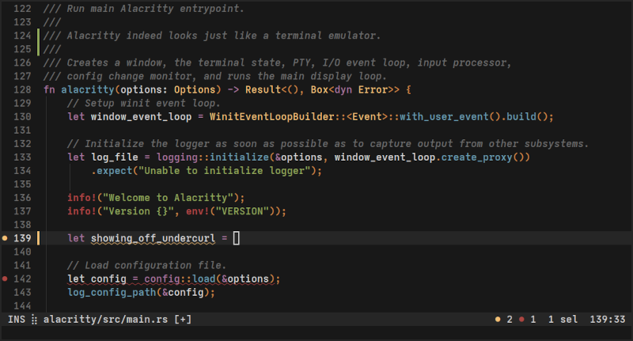
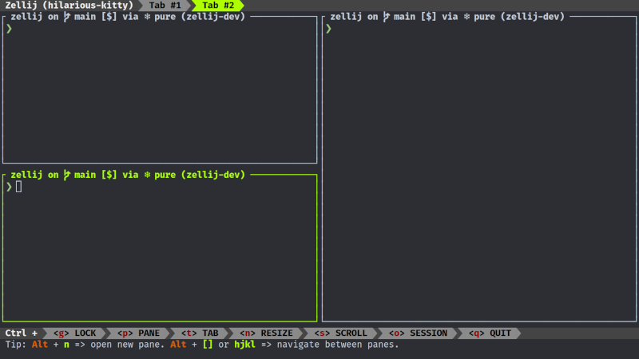
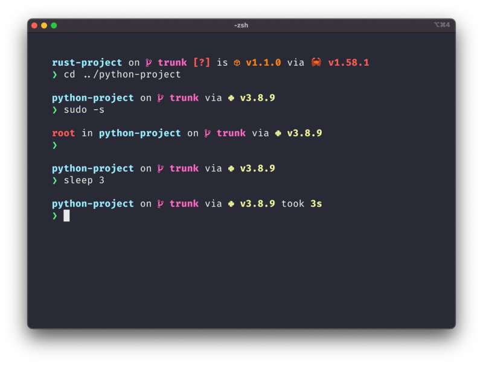

Outils "Blazing-Fast" pour Linux écrits en Rust
###################################################

:date: 2024-10-14  
:tags: linux, rust, tools, outils, performance, blazing-fast  
:category: Rust  
:slug: linux-tools-rust  
:authors: Morgan  
:summary: Outils "Blazing-Fast" pour Linux écrits en Rust

.. image:: ./images/ferris.png  
    :alt: Rust  
    :align: right  

Depuis l'avènement de Rust et du fameux adage "Rewrite it in Rust", de nombreux outils système ont été réécrits en Rust pour bénéficier de meilleures performances dites **blazing-fast**, ainsi que d'une fluidité et d'une ergonomie plus modernes.

Il est temps de remplacer les classiques **ls**, **cd**, **tmux**, **grep** ou encore **find** par leurs jumeaux *Rustaceans* !

C'est parti !

alacritty
=========

On commence par le plus évident, le terminal. `Alacritty <https://alacritty.org/>`_ est un terminal moderne qui se veut très simple dans le sens où il ne va pas gérer les onglets et le split de fenêtres (on utilisera autre chose pour ça juste après). Il tourne sous OpenGL et bénéficie donc de la performance de ta carte graphique. Il supporte les couleurs, les polices et Wayland. Il a également un mode Vi et est hautement configurable via un fichier TOML.

zellij
======

Adieu **tmux** et bonjour `Zellij <https://zellij.dev/>`_ ! C'est un gestionnaire de fenêtres pour terminal qui fonctionne parfaitement avec Alacritty. C'est tout comme tmux, mais en mieux. Il peut gérer les onglets, le split des fenêtres et les sessions. Tu pourras également l'étendre grâce à un système de plugins.

starship
========

Maintenant qu'on a notre terminal et notre gestionnaire de fenêtres, il te faut un joli prompt.  
`Starship <https://starship.rs/>`_ est là pour ça ! La configuration par défaut est vraiment top, et si tu ne veux pas te prendre la tête, tu peux la conserver telle quelle. Tu auras directement les informations de tes branches git, des versions des langages du projet sur lequel tu travailles, et bien d'autres choses.

atuin
=====

`Atuin <https://atuin.sh/>`_ se charge de gérer l'historique de ton shell. Tu pourras synchroniser ton historique de manière encryptée entre plusieurs machines. Ton historique sera donc accessible de partout ! Il sera stocké dans une base de données SQLite, ce qui te permettra d'effectuer des recherches avancées et rapides.

zoxide
======

On va commencer par remplacer les outils GNU classiques. `Zoxide <https://github.com/ajeetdsouza/zoxide>`_ va remplacer ta commande **cd**. Il te permettra de te déplacer dans tes dossiers en fonction de leur fréquence d'utilisation. Donc, imaginons que tu as un projet dans un répertoire **/home/morgan/dev/emploi-du-temps** et que tu y vas souvent, il te suffira de faire un **z emploi** pour y accéder depuis n'importe où. Une fois adopté, tu pourras même te créer un alias **cd** pour **z**.

ripgrep
=======

Cette fois-ci, on va remplacer **grep** par `ripgrep <https://github.com/BurntSushi/ripgrep>`_. C'est un outil vraiment puissant qui te permet de chercher dans tes fichiers de manière récursive très rapidement. Franchement, la première fois que je l'ai lancé, j'ai été vraiment surpris. Une recherche dans beaucoup de dossiers a quasiment été instantanée.

eza
===

`Eza <https://github.com/eza-community/eza>`_ quant à lui, va remplacer ton **ls**. Comme pour Zoxide, tu pourras te créer un alias **ls** pour **eza**. L'affichage te fournira une jolie coloration syntaxique en fonction des types de fichiers.

bat
===

Pour remplacer **cat**, on va utiliser `bat <https://github.com/sharkdp/bat>`_, qui, comme pour Eza, va te fournir une coloration syntaxique de tes fichiers.

fd
==

La commande **find** n'est franchement pas la plus simple à utiliser. `fd <https://github.com/sharkdp/fd>`_ se veut beaucoup plus user-friendly. L'exécution de la recherche est réalisée de manière parallèle, donc c'est très rapide. Tu auras également les couleurs pour faciliter l'affichage.

---

Et voilà, on a fait le tour ! N'hésite pas à commenter si tu en connais d'autres, ça me permettra d'agrandir ma besace !
