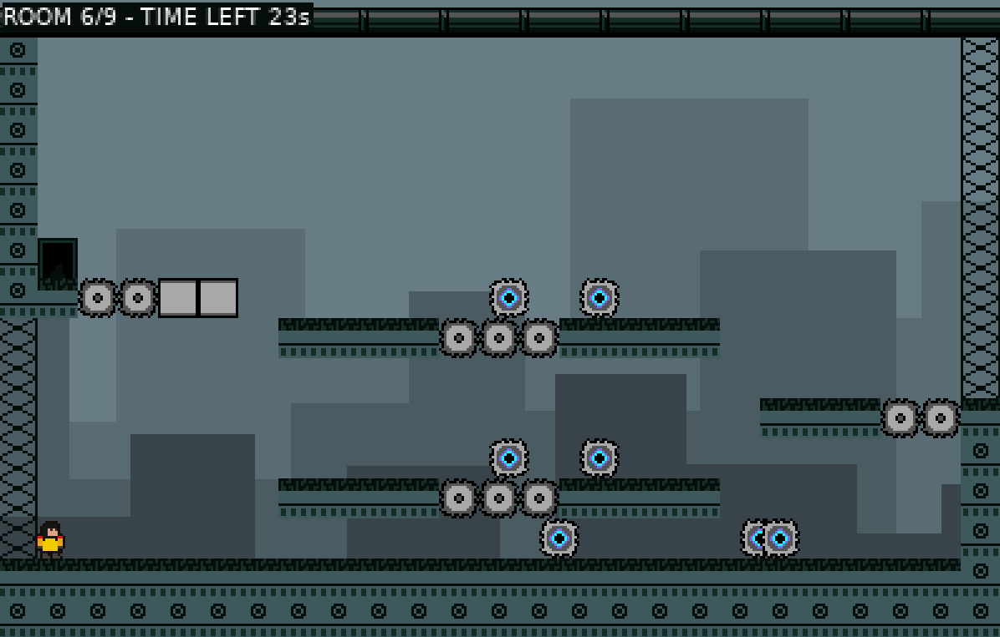
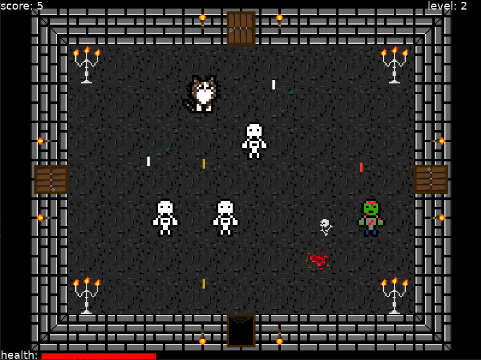

Créer un petit jeu de plateforme avec Löve
##########################################

:date: 2021-03-19
:tags: jeux,video,lua,love2d,plateformer,itch
:category: Lua
:slug: plateformer-love2d
:authors: Morgan
:summary: Créer un petit jeu de plateforme avec Löve

On fait suite au `précédent article du blog <http://dotmobo.github.io/jeux-video-lua.html>`_ qui introduisait le développement de jeux vidéo en Lua avec `Löve <https://love2d.org/>`_.
Tu vas voir comment créer un petit jeu de plateforme inspiré de `Super Meat Boy <https://store.steampowered.com/app/40800/Super_Meat_Boy/>`_ et de `Disc Room <https://store.steampowered.com/app/1229580/Disc_Room/>`_ uniquement avec Löve.

Disc Room Escape
-----------------

Le jeu s'appelle Disc Room Escape et `est jouable sur itch.io <https://dotmobo.itch.io/disc-room-escape>`_.
Le but est simplement de traverser les différents niveaux, sans mourir, dans la limite de temps disponible.
Il faudra sauter sur des plateformes et éviter des scies mortelles.

Ici, pas besoin de librairies et outils annexes. Tout sera fait uniquement avec Löve.

Code source
------------

Le code source est `intégralement disponible sur Github <https://github.com/dotmobo/disc-room-escape>`_.
N'hésite pas à le récupérer, à jouer avec, à le modifier et à te l'approprier.

Je vais t'expliquer dans les grandes lignes son fonctionnement. Suis les liens vers les fichiers sources pour les comprendre.
Sur cet article, je ne mettrais en exemple que certains bouts de code intéressants pour éviter de trop le surcharger d'information.

Etat du jeu
-----------

On va commencer par créer un système qui gère l'état de notre jeu. Dans les prochains fichiers, on va beaucoup utiliser **setmetatable**,
qui permet de gérer des sortes de `classes en Lua <https://www.lua.org/pil/16.1.html>`_.

Tu voudras avoir `un écran d'accueil <https://github.com/dotmobo/disc-room-escape/blob/master/StartState.lua>`_ où tu lances le jeu,
`un écran avec le jeu en cours <https://github.com/dotmobo/disc-room-escape/blob/master/PlayState.lua>`_,
`un écran de fin lors de la victoire <https://github.com/dotmobo/disc-room-escape/blob/master/WinState.lua>`_ et
`un écran de fin lors de la défaite <https://github.com/dotmobo/disc-room-escape/blob/master/DeadState.lua>`_. Ces écrans vont utiliser les fonctions
**update** et **draw** de Löve pour se mettre à jour, afficher les éléments et gérer les touches.

.. code-block:: lua

    function mt:update(dt)
        if love.keyboard.isDown('return') or (Joystick and Joystick:isGamepadDown('start')) then
            GameState.setCurrent('Play', GAME_LEVEL_START)
            local doorSound = love.audio.newSource(SOUND_DOOR, "static")
            doorSound:play()
        end
    end

    function mt:draw()
        love.graphics.setNewFont(12)
        love.graphics.setColor(1, 1, 1, 1)
        love.graphics.setBackgroundColor( 104/255, 124/255, 133/255 )
        love.graphics.draw(self.img, 70, 0, 0, 0.4, 0.4)
        love.graphics.print({{0,0,0,1}, 'Press [enter] or [start] to start the game !'}, 75, 220)
    end

Tous ces écrans vont être manipulables grâce à `une classe GameState <https://github.com/dotmobo/disc-room-escape/blob/master/GameState.lua>`_
qui va se charger de gérer la transition des états. Il suffit par exemple, d'utiliser la commande suivante pour changer de niveau :

.. code-block:: lua
    
    GameState.setCurrent('Play', self.level_num + 1)

Le `fichier principal de Löve <https://github.com/dotmobo/disc-room-escape/blob/master/main.lua>`__ va juste se charger de démarrer le jeu sur
l'écran d'accueil et d'initier le joystick, `le fichier de configuration <https://github.com/dotmobo/disc-room-escape/blob/master/conf.lua>`_ et
`les constantes du jeu <https://github.com/dotmobo/disc-room-escape/blob/master/const.lua>`_.

Animation et assets
-------------------

Tous les assets du jeu, sons et images, sont disponibles `ici <https://github.com/dotmobo/disc-room-escape/tree/master/assets>`_.
Tu peux les modifier selon tes propres envies. Tu auras besoin de deux petits helpers,
`un pour gérer les animations <https://github.com/dotmobo/disc-room-escape/blob/master/Animation.lua>`_ et
`un autre pour gérer les assets <https://github.com/dotmobo/disc-room-escape/blob/master/assets.lua>`_.

Le monde
--------

Chaque élément du jeu sera ajouté à `un monde <https://github.com/dotmobo/disc-room-escape/blob/master/World.lua>`_, qui va se charger de
vérifier en continue la position des éléments et leurs collisions. 

On vérifie la collision de nos éléments à l'aide d'une fonction toute simple :

.. code-block:: lua

    local function checkCollision(a, b)
        return a.x < b.x + b.w and
            a.x + a.w > b.x and
            a.y < b.y + b.h and
            a.h + a.y > b.y
    end

Les niveaux
-----------

Les niveaux seront représentés par des tableaux de la manière suivante :

.. code-block:: lua

    return {
        6,6,6,6,6,6,6,6,6,6,6,6,6,6,6,6,6,6,6,6,6,6,6,6,6,
        10,0,0,0,0,0,0,0,0,0,0,0,0,0,0,0,0,0,0,0,0,0,0,0,10,
        10,0,0,0,0,0,0,0,0,0,0,0,0,0,0,0,0,0,0,0,0,0,0,0,10,
        10,0,0,0,0,0,0,0,0,0,0,0,0,0,0,0,0,0,0,0,0,0,0,0,10,
        10,0,0,0,0,0,0,0,0,0,0,0,0,0,0,0,0,0,0,0,0,0,0,0,10,
        10,0,0,0,0,0,0,0,0,0,0,0,0,0,0,0,0,0,0,0,0,0,0,0,10,
        10,0,0,0,0,0,0,0,0,0,0,0,0,0,0,0,0,0,0,0,0,0,0,0,10,
        10,0,0,0,0,0,0,0,0,0,0,0,0,0,0,0,0,0,0,0,0,0,0,0,10,
        10,0,0,0,0,0,0,0,0,0,0,0,0,0,0,0,0,0,0,0,0,0,0,0,10,
        10,0,0,0,0,0,0,0,0,0,0,0,0,0,0,0,0,0,0,0,0,0,0,0,10,
        10,0,0,0,0,0,0,0,0,0,0,0,0,0,0,0,0,0,0,0,0,0,0,0,10,
        10,0,0,0,0,0,0,0,0,0,0,0,0,0,0,0,0,0,0,0,0,0,0,0,10,
        10,0,0,0,0,0,0,0,0,3,3,0,0,0,3,3,0,0,0,0,0,0,0,0,10,
        10,9,0,0,0,0,0,0,0,0,0,0,0,0,0,0,0,0,0,0,0,0,4,0,10,
        2,2,2,2,2,2,2,0,0,0,0,0,0,0,0,0,0,0,2,2,2,2,2,2,2,
        1,1,1,1,1,1,1,5,5,5,5,5,5,5,5,5,5,5,1,1,1,1,1,1,1,
    }

Chaque chiffre va représenter un élément sur notre écran. 

- le 0 représente le vide.
- le 1 sera `des murs <https://github.com/dotmobo/disc-room-escape/blob/master/Wall.lua>`_.
- le 2 sera `le sol <https://github.com/dotmobo/disc-room-escape/blob/master/Floor.lua>`_.
- le 3 sera `des plateformes amovibles <https://github.com/dotmobo/disc-room-escape/blob/master/ToggleFloor.lua>`_.
- le 4 sera `les portes de sorties <https://github.com/dotmobo/disc-room-escape/blob/master/Door.lua>`_.
- le 5 sera `des scies fixes <https://github.com/dotmobo/disc-room-escape/blob/master/Disc.lua>`_.
- le 6 sera `le toît <https://github.com/dotmobo/disc-room-escape/blob/master/Roof.lua>`_.
- le 7 sera `le boss du jeu <https://github.com/dotmobo/disc-room-escape/blob/master/Boss.lua>`_.
- le 8 sera `les ennemies du jeu <https://github.com/dotmobo/disc-room-escape/blob/master/Enemy.lua>`_, des scies qui se déplacent.
- le 9 sera `notre héro <https://github.com/dotmobo/disc-room-escape/blob/master/Hero.lua>`_.
- le 10 sera un élement du décor, `l'échafaudage <https://github.com/dotmobo/disc-room-escape/blob/master/Scaffold.lua>`_.

Chacun de ces éléments utilise le système de classes de Lua via **setmetatable** pour sa représentation.
Une `classe Level <https://github.com/dotmobo/disc-room-escape/blob/master/Level.lua>`_ va se charger de l'affichage des éléments du niveau en fonction de ces chiffres.

Il sera alors possible de déclencher des évenements dans le monde, par exemple lorsque le joueur franchit une porte.

Dans notre classe *Door* on a :

.. code-block:: lua

    function mt:update(dt)
        self.touches_hero = GameState.getCurrent().world:check(self, 'is_hero')
    end

    function mt:draw()
        assets.qdraw(7, self.x, self.y)
        if self.touches_hero then
            GameState.getCurrent():trigger('door:open')
        end
    end

Et dans l'état du jeu en cours *PlayState* on a :

.. code-block:: lua

    function mt:trigger(event, actor, data)
        if event == 'door:open' then
            local doorSound = love.audio.newSource(SOUND_DOOR, "static")
            doorSound:play()
            if self.level_num < GAME_LEVEL_MAX then
                GameState.setCurrent('Play', self.level_num + 1)
            else
                GameState.setCurrent('Win')
            end
        end
    end

Le hero
-------

Notre hero va devoir se déplacer si on utilise le joystick ou le clavier, en utilisant un système d'accélération et de décélération dans son **update** :

.. code-block:: lua

    local dx, dy = 0, 0

    if love.keyboard.isDown('left') or (Joystick and (Joystick:isGamepadDown('dpleft') or Joystick:getGamepadAxis('leftx') <= -0.25)) then
        self:setAnim('run')
        self.last_direction = -1
        -- acceleration system
        self.vx = self.vx + (-self.speed * self.acceleration * dt)
        if self.vx < -self.speed then self.vx = -self.speed end
    elseif love.keyboard.isDown('right') or (Joystick and (Joystick:isGamepadDown('dpright') or Joystick:getGamepadAxis('leftx') >= 0.25)) then
        self:setAnim('run')
        self.last_direction = 1
        -- acceleration system
        self.vx = self.vx + (self.speed * self.acceleration * dt)
        if self.vx > self.speed then self.vx = self.speed end
    else
        -- deceleration system
        if self.vx < 0 then
            self.vx = self.vx + (self.speed * self.deceleration * dt)
            if self.vx > 0 then self.vx = 0 end
        elseif self.vx > 0 then
            self.vx = self.vx + (-self.speed * self.deceleration * dt)
            if self.vx < 0 then self.vx = 0 end
        end
    end
    dx = dx + self.vx * dt

Tu va devoir gérer la gravité lors du saut dans le **update** également :

.. code-block:: lua

    if (love.keyboard.isDown('up') or (Joystick and (Joystick:isGamepadDown('a')))) then
        -- init jump
        if self:canJump() then
            self.vy = HERO_JUMP_SPEED
            self.is_jumping = true
            local jumpSound = love.audio.newSource(SOUND_JUMP, "static")
            jumpSound:play()
        -- during the jump
        elseif self.is_jumping == true then
            -- reduce the gravity for smooth jump
            if self.vy < 0 then
                self.vy = self.vy - HERO_JUMP_GRAVITY * dt
            end
        end
    end
    -- gravity
    if self:isGrounded() then
        self.vy = 0
        self.is_jumping = false
        self.ungroundedTime = 0
    else
        self:setAnim('jump')
        self.vy = math.min(self.vy + HERO_GRAVITY * dt, HERO_MAX_VELOCITY)
        self.ungroundedTime = self.ungroundedTime + dt
    end

Et bien évidemment, il faudra l'animer à l'aide de notre helper :

.. code-block:: lua

    self:setAnim('run')

et enfin le déplacer dans notre monde via :

.. code-block:: lua

    GameState.getCurrent().world:move(self, self.x + dx, self.y + self.vy, 'is_solid')

Les particules de sang
----------------------

Enfin, à la mort, on va utiliser `un système de particules <https://github.com/dotmobo/disc-room-escape/blob/master/Particles.lua>`_ pour gérer le sang.
On va pouvoir utiliser différents paramètres pour styliser nos particules :

.. code-block:: lua

    p.psystem:setParticleLifetime(0.5, 3)
    p.psystem:setEmissionRate(128)
    p.psystem:setEmitterLifetime(0.5)
    p.psystem:setSizeVariation(1)
    p.psystem:setLinearAcceleration(-100, -100, 100, 100)
    p.psystem:setColors(1, 1, 1, 1, 1, 1, 1, 0)

Conclusion
----------

J'espère que cet aperçu va te donner envie d'essayer Löve plus en profondeur !

Ici, on a tout fait à la main, sans librairie. C'est la meilleur manière de procéder je pense pour avoir le contrôle complet de ton code.

Mais si tu veux voir ce que ça donne en utilisant des librairies de gestion de
collisions comme `Bump <https://github.com/kikito/bump.lua>`_, des utilitaires pour gérer l'état du jeu ou la caméra comme `Hump <https://github.com/HDictus/hump>`_,
l'outil de gestion des animations `Anim8 <https://github.com/kikito/anim8>`_, ou encore l'utilitaire `STI <https://github.com/karai17/Simple-Tiled-Implementation>`_
pour manipuler des niveaux créés avec `Tiled <https://www.mapeditor.org/>`_, tu peux jeter un oeil à mon deuxième projet Löve, `The Legend Of Shifu <https://dotmobo.itch.io/the-legend-of-shifu>`_,
dont l'intégralité du code source est `disponible sur Github <https://github.com/dotmobo/the-legend-of-shifu>`_. C'est un petit jeu inspiré de
`The Binding Of Isaac <https://store.steampowered.com/app/250900/The_Binding_of_Isaac_Rebirth/>`_.

Have fun !