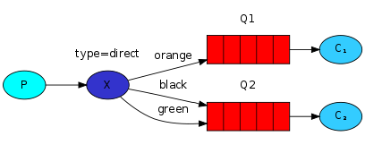

Découverte du message broker RabbitMQ
#####################################

:date: 2017-09-26
:tags: rabbitmq,message broker,python
:category: Python
:slug: rabbitmq
:authors: Morgan
:summary: Découverte du message broker RabbitMQ

.. image:: ./images/rabbitmq_logo.png
    :alt: RabbitMQ
    :width: 500px
    :align: right

`RabbitMQ <https://www.rabbitmq.com/>`_ est ce qu'on appelle un *message broker*.

Grosso-modo, ça sert à gérer des files de messages. Il permet ainsi de reçevoir et de transmettre des messages de différentes
manières.

Je te le recommande fortement car c'est un outil léger, très robuste, performant et simple d'utilisation.

Il existe depuis plus de 10 ans maintenant et est utilisé dans de grosses entreprises comme Ford, Instagram ou le New York Times.

S'il fallait schématiser ce que représenterait Rabbitmq dans l'IRL, ça serait le bureau de poste, la boite aux lettres ainsi que le facteur !

Communication
=============

Il utilise un protocole de communication appelé **AMQP** (Advanced Message Queuing Protocol), qui permet de standardiser les échanges.
Ce protocole provient d'un consortium entre différentes entreprises tel que JPMorgan, Microsoft, Red Hat et Cisco.

Il en existe de nombreuses implémentations dans plein de langages, comme en Python avec `Pika <https://github.com/pika/pika>`_, en Java,
en Php, en Javascript, en Ruby, etc...

Vocabulaire
===========

Si tu fouilles un peu dans le doc officielle, tu remarqueras l'utilisation de certains vocabulaires.

Histoire de ne pas être complètement perdu, voici les plus importants :

* **Producer**: celui qui envoie des messages |producer|
* **Queue**: file qui stocke les messages |queue|
* **Consumer**: celui qui reçoit les messages |consumer|
* **Exchange**: là où on peut déposer les messages |exchange|

.. |producer| image:: ./images/producer.png
.. |queue| image:: ./images/queue.png
.. |consumer| image:: ./images/consumer.png
.. |exchange| image:: ./images/exchange.png

Installation
============

Sur Ubuntu, Rabbitmq est présent dans les dépôts officiels, donc rien de plus simple à installer:

.. code-block:: bash

    # Install the package
    apt-get install -y rabbitmq-server

À l'aide de **rabbitmqctl**, tu vas pouvoir ajouter des utilisateurs, gérer les permissions, créer des *Virtual Hosts*
(oui, c'est bien le même concept que pour Apache), effacer des utilisateurs, etc...

.. code-block:: bash

    # Add rabbitmq user
    rabbitmqctl add_user myuser mypassword
    # Add rabbitmq vhost
    rabbitmqctl add_vhost myproject
    # Add a tag to the user
    rabbitmqctl set_user_tags myuser management
    # Add vhost all permissions (conf, read, write) to the user
    rabbitmqctl set_permissions -p myproject myuser ".*" ".*" ".*"
    # Delete the guest user
    rabbitmqctl delete_user guest
    # Check user authentication
    rabbitmqctl authenticate_user myuser mypassword

Ici, j'ai volontairement effacé l'utilisateur *guest* qui est activé par défaut.

Administration
==============

Tu peux administrer Rabbitmq de deux manières:

* Via une interface web disponible sur *http://server-name:15672/* en activant le plugin *management*:

.. code-block:: bash

    rabbitmq-plugins enable rabbitmq_management

* ou en ligne de commande via **rabbitmqctl**:

.. code-block:: bash

    # users
    rabbitmqctl list_users
    rabbitmqctl delete_user <username>
    rabbitmqctl change_password <username> <newpassword>
    # queue
    rabbitmqctl list_queues -p myproject
    rabbitmqctl purge_queue queue
    rabbitmqctl list_connections
    rabbitmqctl list_channels
    rabbitmqctl list_consumers
    rabbitmqctl list_exchanges
    # vhost
    rabbitmqctl list_vhosts
    rabbitmqctl list_permissions -p myproject

Installation du client Python
=============================

Pour installer le client Python Pika, tu utilises pip comme d'hab':

.. code-block:: bash

    pip install pika

Scénarios
=========

Voyons maintenant les différents types de scénarios possibles pour son usage.

Hello World 
-----------

|helloworld|

* Le *producer* envoie des messages dans la *queue* hello.
* Le *consumer* reçoit les messages de cette *queue*.

.. |helloworld| image:: ./images/python-one-overall.png

Le code du *producer* **send.py**:

.. code-block:: python

    #!/usr/bin/env python
    import pika

    connection = pika.BlockingConnection(pika.ConnectionParameters(host='localhost'))
    channel = connection.channel()

    channel.queue_declare(queue='hello')

    channel.basic_publish(exchange='',
                        routing_key='hello',
                        body='Hello World!')
    print(" [x] Sent 'Hello World!'")
    connection.close()

Le code du *consumer* **receive.py**:

.. code-block:: python

    #!/usr/bin/env python
    import pika

    connection = pika.BlockingConnection(pika.ConnectionParameters(host='localhost'))
    channel = connection.channel()

    channel.queue_declare(queue='hello')

    def callback(ch, method, properties, body):
        print(" [x] Received %r" % body)

    channel.basic_consume(callback,
                        queue='hello',
                        no_ack=True)

    print(' [*] Waiting for messages. To exit press CTRL+C')
    channel.start_consuming()

Et au final, tu as comme résultat:

.. code-block:: bash

    python receive.py
    # => [*] Waiting for messages. To exit press CTRL+C
    # => [x] Received 'Hello World!'

.. code-block:: bash

    python send.py
    # => [x] Sent 'Hello World!'

Work queues
-----------

|workqueues|

* Le *producer* envoie des jobs à effectuer dans une *queue*.
* Plusieurs *consumers* se répartissent les tâches.
* C'est utile pour des tâches longues (encodage, importation, copies).

.. |workqueues| image:: ./images/python-two.png

Le code du *producer* **new_task.py**:

.. code-block:: python

    #!/usr/bin/env python
    import pika
    import sys

    connection = pika.BlockingConnection(pika.ConnectionParameters(host='localhost'))
    channel = connection.channel()

    channel.queue_declare(queue='task_queue', durable=True)

    message = ' '.join(sys.argv[1:]) or "Hello World!"
    channel.basic_publish(exchange='',
                        routing_key='task_queue',
                        body=message,
                        properties=pika.BasicProperties(
                            delivery_mode = 2, # make message persistent
                        ))
    print(" [x] Sent %r" % message)
    connection.close()

Le code du *consumer* **worker.py**:

.. code-block:: python

    #!/usr/bin/env python
    import pika
    import time

    connection = pika.BlockingConnection(pika.ConnectionParameters(host='localhost'))
    channel = connection.channel()

    channel.queue_declare(queue='task_queue', durable=True)
    print(' [*] Waiting for messages. To exit press CTRL+C')

    def callback(ch, method, properties, body):
        print(" [x] Received %r" % body)
        time.sleep(body.count(b'.'))
        print(" [x] Done")
        ch.basic_ack(delivery_tag = method.delivery_tag)

    channel.basic_qos(prefetch_count=1)
    channel.basic_consume(callback,
                        queue='task_queue')

    channel.start_consuming()

Il suffit alors d'exécuter les fichiers pour simuler le fonctionnement de la file de jobs.

Publish/Subscribe
-----------------

|pubsub|

* Le *producer* veut délivrer un message à plusieurs *consumers*.
* À l'inverse du scénario précédent, tous les *consumers* recoivent le message.
* Le *producer* envoie son message à l'*exchange* qui se chargera de le délivrer aux différentes files.
* L'*exchange* de type *fanout* délivre le message à toutes les files.

.. |pubsub| image:: ./images/python-three-overall.png

Le code du *producer* **emit_log.py**:

.. code-block:: python

    #!/usr/bin/env python
    import pika
    import sys

    connection = pika.BlockingConnection(pika.ConnectionParameters(host='localhost'))
    channel = connection.channel()

    channel.exchange_declare(exchange='logs',
                            exchange_type='fanout')

    message = ' '.join(sys.argv[1:]) or "info: Hello World!"
    channel.basic_publish(exchange='logs',
                        routing_key='',
                        body=message)
    print(" [x] Sent %r" % message)
    connection.close()

Le code du *consumer* **receive_logs.py**:

.. code-block:: python

    #!/usr/bin/env python
    import pika

    connection = pika.BlockingConnection(pika.ConnectionParameters(host='localhost'))
    channel = connection.channel()

    channel.exchange_declare(exchange='logs',
                            exchange_type='fanout')

    result = channel.queue_declare(exclusive=True)
    queue_name = result.method.queue

    channel.queue_bind(exchange='logs',
                    queue=queue_name)

    print(' [*] Waiting for logs. To exit press CTRL+C')

    def callback(ch, method, properties, body):
        print(" [x] %r" % body)

    channel.basic_consume(callback,
                        queue=queue_name,
                        no_ack=True)

    channel.start_consuming()

Comme avant, tu lances les deux fichiers pour tester.

Routing
-------

|routing|

* L'*exchange* de type *direct* redirige automatiquement dans la bonne file en fonction d'une clé.
* C'est utile pour gérer des logs par exemple.

Le code du *producer* **emit_log_direct.py**:

.. code-block:: python

    #!/usr/bin/env python
    import pika
    import sys

    connection = pika.BlockingConnection(pika.ConnectionParameters(host='localhost'))
    channel = connection.channel()

    channel.exchange_declare(exchange='direct_logs',
                            exchange_type='direct')

    severity = sys.argv[1] if len(sys.argv) > 2 else 'info'
    message = ' '.join(sys.argv[2:]) or 'Hello World!'
    channel.basic_publish(exchange='direct_logs',
                        routing_key=severity,
                        body=message)
    print(" [x] Sent %r:%r" % (severity, message))
    connection.close()

Le code du *consumer* **receive_logs_direct.py**:

.. code-block:: python

    #!/usr/bin/env python
    import pika
    import sys

    connection = pika.BlockingConnection(pika.ConnectionParameters(host='localhost'))
    channel = connection.channel()

    channel.exchange_declare(exchange='direct_logs',
                            exchange_type='direct')

    result = channel.queue_declare(exclusive=True)
    queue_name = result.method.queue

    severities = sys.argv[1:]
    if not severities:
        sys.stderr.write("Usage: %s [info] [warning] [error]\n" % sys.argv[0])
        sys.exit(1)

    for severity in severities:
        channel.queue_bind(exchange='direct_logs',
                        queue=queue_name,
                        routing_key=severity)

    print(' [*] Waiting for logs. To exit press CTRL+C')

    def callback(ch, method, properties, body):
        print(" [x] %r:%r" % (method.routing_key, body))

    channel.basic_consume(callback,
                        queue=queue_name,
                        no_ack=True)

    channel.start_consuming()

Tu t'attends alors à reçevoir des messages de type *info*, *warning* et *error*:

.. code-block:: bash

    python receive_logs_direct.py info warning error
    # => [*] Waiting for logs. To exit press CTRL+C

Par exemple, pour émettre un message de type *error*:

.. code-block:: bash

    python emit_log_direct.py error "Run. Run. Or it will explode."
    # => [x] Sent 'error':'Run. Run. Or it will explode.'

Topics
------

|topics|

* L'*exchange* de type *topic* permet de rediriger sur la bonne file en fonction de critères multiples.
* Le message avec la clé de **routage quick.orange.rabbit** ira dans les 2 files.

.. |topics| image:: ./images/python-five.png

Le code du *producer* **emit_log_topic.py**:

.. code-block:: python

    #!/usr/bin/env python
    import pika
    import sys

    connection = pika.BlockingConnection(pika.ConnectionParameters(host='localhost'))
    channel = connection.channel()

    channel.exchange_declare(exchange='topic_logs',
                            exchange_type='topic')

    routing_key = sys.argv[1] if len(sys.argv) > 2 else 'anonymous.info'
    message = ' '.join(sys.argv[2:]) or 'Hello World!'
    channel.basic_publish(exchange='topic_logs',
                        routing_key=routing_key,
                        body=message)
    print(" [x] Sent %r:%r" % (routing_key, message))
    connection.close()

Le code du *consumer* **receive_logs_topic.py**:

.. code-block:: python

    #!/usr/bin/env python
    import pika
    import sys

    connection = pika.BlockingConnection(pika.ConnectionParameters(host='localhost'))
    channel = connection.channel()

    channel.exchange_declare(exchange='topic_logs',
                            exchange_type='topic')

    result = channel.queue_declare(exclusive=True)
    queue_name = result.method.queue

    binding_keys = sys.argv[1:]
    if not binding_keys:
        sys.stderr.write("Usage: %s [binding_key]...\n" % sys.argv[0])
        sys.exit(1)

    for binding_key in binding_keys:
        channel.queue_bind(exchange='topic_logs',
                        queue=queue_name,
                        routing_key=binding_key)

    print(' [*] Waiting for logs. To exit press CTRL+C')

    def callback(ch, method, properties, body):
        print(" [x] %r:%r" % (method.routing_key, body))

    channel.basic_consume(callback,
                        queue=queue_name,
                        no_ack=True)

    channel.start_consuming()

Tu peux maintenant utiliser les topics de différentes manières :

.. code-block:: bash

    # To receive all the logs run:
    python receive_logs_topic.py "#"

    # To receive all logs from the facility "kern":
    python receive_logs_topic.py "kern.*"
    
    # Or if you want to hear only about "critical" logs:
    python receive_logs_topic.py "*.critical"
    
    # You can create multiple bindings:
    python receive_logs_topic.py "kern.*" "*.critical"
    
    # And to emit a log with a routing key "kern.critical" type:
    python emit_log_topic.py "kern.critical" "A critical kernel error"

RPC
---

|rpc|

* RPC permet d'exécuter une fonction distante en mode *Request/Reply*.
* Le client envoie une *request* avec une clé unique et le nom de la file de retour.
* Le serveur attend les requêtes, exécute la fonction et retourne la réponse.

.. |rpc| image:: ./images/python-six.png

Le code de la partie *server* *rpc_server.py* :

.. code-block:: python

    #!/usr/bin/env python
    import pika

    connection = pika.BlockingConnection(pika.ConnectionParameters(host='localhost'))

    channel = connection.channel()

    channel.queue_declare(queue='rpc_queue')

    def fib(n):
        if n == 0:
            return 0
        elif n == 1:
            return 1
        else:
            return fib(n-1) + fib(n-2)

    def on_request(ch, method, props, body):
        n = int(body)

        print(" [.] fib(%s)" % n)
        response = fib(n)

        ch.basic_publish(exchange='',
                        routing_key=props.reply_to,
                        properties=pika.BasicProperties(correlation_id = \
                                                            props.correlation_id),
                        body=str(response))
        ch.basic_ack(delivery_tag = method.delivery_tag)

    channel.basic_qos(prefetch_count=1)
    channel.basic_consume(on_request, queue='rpc_queue')

    print(" [x] Awaiting RPC requests")
    channel.start_consuming()

Le code de la partie *cliente* *rpc_client.py* :

.. code-block:: python

    #!/usr/bin/env python
    import pika
    import uuid

    class FibonacciRpcClient(object):
        def __init__(self):
            self.connection = pika.BlockingConnection(pika.ConnectionParameters(host='localhost'))

            self.channel = self.connection.channel()

            result = self.channel.queue_declare(exclusive=True)
            self.callback_queue = result.method.queue

            self.channel.basic_consume(self.on_response, no_ack=True,
                                    queue=self.callback_queue)

        def on_response(self, ch, method, props, body):
            if self.corr_id == props.correlation_id:
                self.response = body

        def call(self, n):
            self.response = None
            self.corr_id = str(uuid.uuid4())
            self.channel.basic_publish(exchange='',
                                    routing_key='rpc_queue',
                                    properties=pika.BasicProperties(
                                            reply_to = self.callback_queue,
                                            correlation_id = self.corr_id,
                                            ),
                                    body=str(n))
            while self.response is None:
                self.connection.process_data_events()
            return int(self.response)

    fibonacci_rpc = FibonacciRpcClient()

    print(" [x] Requesting fib(30)")
    response = fibonacci_rpc.call(30)
    print(" [.] Got %r" % response)

Et pour tester ça :

.. code-block:: bash

    python rpc_server.py
    # => [x] Awaiting RPC requests

.. code-block:: bash

    python rpc_client.py
    # => [x] Requesting fib(30)

Conclusion
----------

Cette introduction résume la `doc officielle <https://www.rabbitmq.com/getstarted.html>`_,
mais n'hésite pas à te plonger dedans pour plus de détail si besoin.

Il est possible, par exemple, d'activer la persistance des données, d'authentifier les connections via un serveur LDAP et autres.

Dans une prochaine partie, nous verrons comment utiliser `Celery <http://www.celeryproject.org/>`_ avec Rabbitmq.
