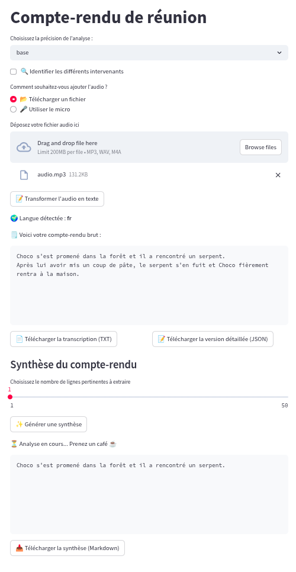

Développer une UI pour Whisper avec Streamlit
#############################################

:date: 2025-04-03
:tags: Python, Streamlit, LLM, Whisper
:category: IA
:slug: whisper
:authors: Morgan
:summary: Développer une UI pour Whisper avec Streamlit

.. image:: ./images/openai.png
    :alt: Whisper
    :align: right

`Whisper <https://github.com/openai/whisper>`_ est un modèle IA de **speech-to-text** créé par OpenAI et qui marche plutôt pas mal.
L'outil est open source et s'utilise en ligne de commande directement. Il te permet de transcrire
de l'audio en texte, de faire des traductions directes en anglais, de traduire des vidéos pour en
générer des sous-titres, etc.

Mais pourquoi ne pas se faire une petite app avec `streamlit <https://streamlit.io/>`_, histoire de l'utiliser plus facilement
et d'avoir une UI sympathique pour les utilisateurs ?

Prérequis
---------

Bon, forcément, il te faut **python**. Pour cet article, j'ai utilisé la version 3.9 mais ça devrait
marcher avec les versions plus récentes.

Tu te fais un environnement virtuel et tu installes les dépendances suivantes :

.. code-block:: bash

    pip install openai-whisper
    pip install streamlit
    pip install pyannote.audio
    pip install sumy

En gros, l'idée ici sera de permettre à l'utilisateur de faire une transcription d'un audio avec whisper,
puis d'identifier automatiquement les personnes qui parlent avec `pyannote <https://github.com/pyannote/pyannote-audio>`_ (diarization), et enfin de sortir les phrases les plus 
importantes de la transcription pour en faire un résumé avec `sumy <https://github.com/miso-belica/sumy>`_.

Développement
-------------

Tu peux te créer un fichier `main.py` pour ton app streamlit et on va attaquer le code.

On commence par télécharger `nltk <https://www.nltk.org/>`_ qui sera nécessaire pour sumy, pour la tokenisation des phrases.

.. code-block:: python

    import nltk
    nltk.download("punkt", quiet=True)
    nltk.download("punkt_tab", quiet=True)

Ensuite on met un titre et on affiche un selectbox pour choisir le modèle whisper ainsi qu'une checkbox pour activer la diarization.

.. code-block:: python

    import streamlit as st
    st.title("Compte-rendu de réunion")

    WHISPER_MODEL_OPTIONS = ["tiny", "base", "small", "medium", "large", "turbo"]
    selected_model = st.selectbox("Choisissez la précision de l'analyse :", WHISPER_MODEL_OPTIONS, index=1)
    diarization_enabled = st.checkbox("🔍 Identifier les différents intervenants", value=False)

On charge alors le modèle whisper et le modèle pyannote en cache pour améliorer les performances.
Note qu'il te faut un token `Hugging Face <https://huggingface.co/>`_ pour pyannote. 
On prend également en compte `CUDA <https://developer.nvidia.com/cuda-toolkit>`_ pour utiliser le GPU si tu en as un. Pour installer CUDA, je te laisse voir
directement avec la documentation officielle.

.. code-block:: python

    import whisper
    import torch
    from pyannote.audio import Pipeline
    
    @st.cache_resource
    def load_whisper_model(model_name: str) -> whisper.Whisper:
        device = "cuda" if torch.cuda.is_available() else "cpu"
        return whisper.load_model(model_name, device=device)

    @st.cache_resource
    def load_diarization_model() -> Pipeline:
        access_token = "ton-token-huggingface"
        pipeline = Pipeline.from_pretrained("pyannote/speaker-diarization-3.1", use_auth_token=access_token)
        device = torch.device("cuda" if torch.cuda.is_available() else "cpu")
        pipeline.to(device)
        return pipeline

    model = load_whisper_model(selected_model)
    diarization_model = load_diarization_model() if diarization_enabled else None

Ensuite, on propose à l'utilisateur s'il veut utiliser son micro ou uploader un fichier audio.

.. code-block:: python

    input_option = st.radio(
        "Comment souhaitez-vous ajouter l'audio ?", ("📂 Télécharger un fichier", "🎤 Utiliser le micro")
    )

On gère également la transcription et le résumé en session pour éviter que streamlit ne relance
les fonctions à chaque fois qu'il est rafraîchi par un clic sur un bouton.

.. code-block:: python

    if "transcription_result" not in st.session_state:
        st.session_state.transcription_result = None
        st.session_state.summary = None

    if "previous_input_option" in st.session_state and st.session_state.previous_input_option != input_option:
        st.session_state.transcription_result = None
        st.session_state.summary = None

    st.session_state.previous_input_option = input_option

On attaque maintenant du lourd, la fonction de transcription.

.. code-block:: python

    from typing import Any

    @st.cache_data
    def transcribe_audio(file_path: str) -> dict:
        return model.transcribe(file_path, language=None)

    @st.cache_data
    def diarize_audio(file_path: str) -> Any:
        return diarization_model(file_path) if diarization_model is not None else None

    import torchaudio
    import torchaudio.transforms as T
    import copy
    import os
    from functools import cache

    @cache
    def get_random_name(speaker: str) -> str:
        """
        Return a random name for the speaker.
        """
        names = [
            "Alice",
            "Bob",
            "Charlie",
            "David",
            "Emma",
            "Fanny",
            "Gaston",
            "Hugo",
            "Isabelle",
            "Jules",
        ]
        index = int(speaker.split("_")[-1])
        return names[index] if index < len(names) else f"Locuteur {index}"

    def assign_speakers(transcription: dict, diarization: Any) -> dict:
        new_transcription = copy.deepcopy(transcription)

        for seg in new_transcription["segments"]:
            max_overlap = 0
            assigned_speaker = None

            for turn, _, speaker in diarization.itertracks(yield_label=True):
                overlap_start = max(seg["start"], turn.start)
                overlap_end = min(seg["end"], turn.end)
                overlap_duration = max(0, overlap_end - overlap_start)
                seg_duration = seg["end"] - seg["start"]

                overlap_ratio = overlap_duration / seg_duration

                if overlap_ratio > max_overlap:
                    max_overlap = overlap_ratio
                    assigned_speaker = speaker

            if assigned_speaker:
                seg["speaker"] = get_random_name(assigned_speaker)

        return new_transcription

    def convert_and_resample_audio(input_path: str, output_path: str, target_sr=16000) -> None:
        waveform, sr = torchaudio.load(input_path)
        if sr != target_sr:
            resampler = T.Resample(orig_freq=sr, new_freq=target_sr)
            waveform = resampler(waveform)
        torchaudio.save(output_path, waveform, target_sr)

    def process_transcription(tmp_filename: str) -> None:
        resampled_audio = None
        try:
            st.write("⏳ Analyse en cours... Prenez un café ☕")

            transcription = transcribe_audio(tmp_filename)

            if diarization_enabled:
                st.write("🔍 Identification des intervenants en cours...")
                resampled_audio = tmp_filename.rsplit(".", 1)[0] + "_resampled.wav"
                convert_and_resample_audio(tmp_filename, resampled_audio)
                diarization = diarize_audio(resampled_audio)
                transcription = assign_speakers(transcription, diarization)

            st.session_state.transcription_result = transcription
            st.session_state.summary = None

        except Exception as e:
            st.error(f"❌ Erreur pendant la transcription/diarisation : {str(e)}")
        finally:
            os.remove(tmp_filename)
            if diarization_enabled and resampled_audio is not None:
                os.remove(resampled_audio)

Bon, avant de passer à la suite, on va prendre du temps pour détailler tout ça.

La fonction `process_transcription` commence par transcrire l'audio avec whisper.

Puis, si on a la diarization d'activée, il nous faut d'abord resampler l'audio à 16kHz pour que
pyannote puisse le traiter. Pyannote va alors analyser l'audio pour nous envoyer les différents segments
avec les intervenants identifiés.

Enfin, on assigne les intervenants aux segments audio de whisper.

On essaye de gérer le chevauchement des segments de pyannote avec les segments de whisper pour assigner
le bon intervenant à chaque phrase.

On n'oublie pas de supprimer les fichiers temporaires à la fin et on met les résultats en session.

Maintenant qu'on a nos fonctions prêtes, on va pouvoir les appeler en fonction des 2 cas d'usages : micro ou upload de fichier.

.. code-block:: python

    import tempfile
    import mimetypes

    if input_option == "📂 Télécharger un fichier":
        uploaded_file = st.file_uploader("Déposez votre fichier audio ici", type=["mp3", "wav", "m4a"])

        if uploaded_file is not None:
            if st.button("📝 Transformer l'audio en texte"):
                file_extension = uploaded_file.name.split(".")[-1]
                mime_type, _ = mimetypes.guess_type(uploaded_file.name)
                if mime_type and mime_type.startswith("audio"):
                    with tempfile.NamedTemporaryFile(delete=False, suffix=f".{file_extension}") as tmp_file:
                        tmp_file.write(uploaded_file.read())
                        tmp_filename = tmp_file.name
                    process_transcription(tmp_filename)
                else:
                    st.error("❌ Format non reconnu ! Merci d'ajouter un fichier audio valide.")

    elif input_option == "🎤 Utiliser le micro":
        if "audio_data" not in st.session_state:
            st.session_state.audio_data = None
            st.write("🎤 Cliquez pour enregistrer votre réunion")

        audio_data = st.audio_input("Enregistrez votre message vocal")

        if audio_data:
            audio_bytes = audio_data.getvalue()
            st.session_state.audio_data = audio_bytes

            st.write("✅ Enregistrement terminé.")

        if "audio_data" in st.session_state and st.session_state.audio_data:
            if st.button("📝 Transformer l'audio en texte"):
                st.session_state.transcription_result = None
                st.session_state.summary = None
                with tempfile.NamedTemporaryFile(delete=False, suffix=".wav") as tmp_file:
                    tmp_file.write(st.session_state.audio_data)
                    tmp_filename = tmp_file.name
                process_transcription(tmp_filename)

Et voilà ! On peut alors afficher la transcription brute :

.. code-block:: python

    import json

    if "transcription_result" in st.session_state and st.session_state.transcription_result:
        result = st.session_state.transcription_result
        detected_language = result["language"]
        text_transcription = result["text"]

        st.write(f"🌍 Langue détectée : **{detected_language}**")

        transcript = "\n".join(f"{seg['text']}" for seg in st.session_state.transcription_result["segments"])

        st.write("🗒️ Voici votre compte-rendu brut :")
        st.code(transcript, language="plaintext", height=200, wrap_lines=True)
        json_content = json.dumps(result, indent=4)

A partir de maintenant, tout le reste du code se trouvera dans le bloc du `if "transcription_result" in st.session_state`.

On propose également de la télécharger en JSON et en TXT :

.. code-block:: python

    col1, col2 = st.columns(2)
    with col1:
        st.download_button("📄 Télécharger la transcription (TXT)", transcript, "transcription.txt", "text/plain")
    with col2:
        st.download_button(
            "📝 Télécharger la version détaillée (JSON)", json_content, "transcription.json", "application/json"
        )

Et même chose si on a la diarization activée :

.. code-block:: python
    
    if diarization_enabled:
        st.write("🗣️ Transcription avec intervenants")

        transcript_with_speakers = "\n".join(
            f"[{seg['start']:.1f}s - {seg['end']:.1f}s] {seg.get('speaker', 'Speaker ?')}: {seg['text']}"
            for seg in st.session_state.transcription_result["segments"]
        )

        st.code(transcript_with_speakers, height=200, wrap_lines=True)

        st.download_button(
            "📑 Télécharger la version annotée avec les intervenants",
            transcript_with_speakers,
            "transcript_with_speakers.txt",
            "text/plain",
        )

Le plus gros est fait ! On peut maintenant passer à la génération du résumé. Pour se faire, on va utiliser
sumy avec LexRank.

.. code-block:: python

    from sumy.parsers.plaintext import PlaintextParser
    from sumy.nlp.tokenizers import Tokenizer
    from sumy.summarizers.lex_rank import LexRankSummarizer

    def summarize_text(text: str, num_sentences=5, language="french") -> str:
        try:
            tokenizer = Tokenizer(language)
        except Exception:
            raise ValueError(f"Langue non supportée par le tokenizer : {language}")

        parser = PlaintextParser.from_string(text, tokenizer)
        summarizer = LexRankSummarizer()
        summary = summarizer(parser.document, num_sentences)
        return " ".join(str(sentence) for sentence in summary)

    @st.cache_data
    def summarize(text: str, num_sentences: int, language: str) -> str:
        return summarize_text(text, num_sentences=num_sentences, language=language)

    st.subheader("Synthèse du compte-rendu")

    if "summary" not in st.session_state:
        st.session_state.summary = None

    num_sentences = st.slider(
        "Choisissez le nombre de lignes pertinentes à extraire", min_value=1, max_value=50, value=10
    )

    if st.button("✨ Générer une synthèse"):
        try:
            st.write("⏳ Analyse en cours... Prenez un café ☕")
            summary = summarize(text_transcription, num_sentences=num_sentences, language=detected_language)
            st.session_state.summary = summary
        except ValueError as e:
            st.error(str(e))

    if st.session_state.summary:
        st.code(st.session_state.summary, language="plaintext", height=200, wrap_lines=True)

        st.download_button(
            "📥 Télécharger la synthèse (Markdown)",
            st.session_state.summary,
            "synthese.md",
            "text/markdown",
        )

Et voilà ! On a une UI sympathique pour faire de la transcription et de la synthèse de texte.

Tu peux lancer ton app via :

.. code-block:: bash

    streamlit run main.py

Le rendu final ressemble à ça :

En piste d'amélioration qu'on verra plus tard, on pourra utiliser les phrases extraites par sumy
pour les passer à un LLM afin de générer un compte-rendu stylisé en Markdown.

----

Et voilà ! Plus besoin de prendre des notes pendant tes réunions, laisse whisper s'en charger !